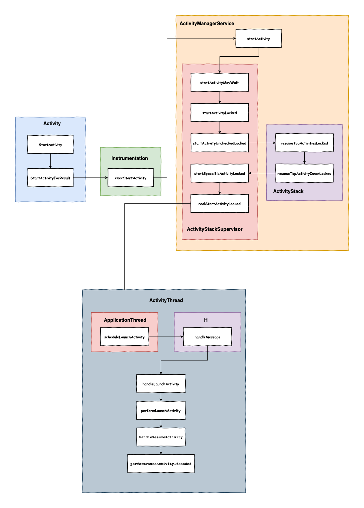
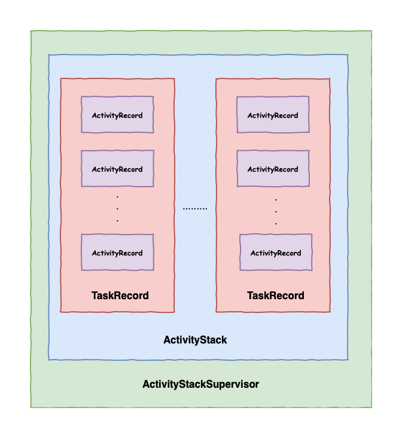

### 前言



### 涉及的主要模块

#### Instrumentation

Android instrumentation 是安卓系统里面的一套控制方法，或者“钩子”，这些钩子可以在正常的生命周期（正常是由操作系统控制的）之外控制Activity的运行，它们同时可以控制Android如何加载应用程序。

简单来说，该类伴随着ActivityThread一块诞生，主要帮助ActivityThread来管理Activity相关工作，同时该类持有AMS(ActivityManagerService)在应用端的Binder，ActivityThread可以通过它和AMS进行通讯。

#### ActivityManagerService

ActivityManagerService简称是AMS，它是Android中很重要的一个服务，它统筹管理着Android中的四大组件，同一调度各应用进程。尤其是Activity的各种栈以及状态切换等管理。因为AMS是系统核心服务，很多API不能直接访问，需要通过客户端的ActivityManager与AMS进行通讯。

#### ActivityStack

ActivityStack，在Android中,每一个ActivityRecord都会有一个Activity与之对应，一个Activity可能会有多个ActivityRecord，因为Activity可以被多次实例化，取决于其launchmode。一系列相关的ActivityRecord组成了一个TaskRecord，TaskRecord是存在于ActivityStack中，ActivityStackSupervisor是用来管理这些ActivityStack的。

>ActivityRecord记录了一个Activity的所有信息，例如token(用于wms交互)、AMS引用、Activity资源信息（如icon、logo、theme等）。

#### ActivityStackSupervisor

ActivityStackSupervisor主要负责管理ActivityStack，内部管理了mHomeStack、mFocusedStack和mLastFocusedStack三个Activity栈。其中，mHomeStack管理的是Launcher相关的Activity栈；mFocusedStack管理的是当前显示在前台Activity的Activity栈；mLastFocusedStack管理的是上一次显示在前台Activity的Activity栈



#### ActivityThread

可以理解为应用程序进程中的主线程。它管理着应用程序进程中主线程的执行，承载者APP上运行的各种Activity/Service/广播等组件。

#### ApplicationThread

它是应用程序在AMS中的Binder对象，AMS利用它可以和ActivityThread通信，四大组件相关回调都是通过它来告诉ActivityThread的。

#### 整体流程

当发起启动 Activity 的请求时，会通过 Instrumentation 来处理，然后它通过 Binder 向 AMS 发送请求，AMS 内部维护者通过 ActivityStackSupervisor 中维护的 ActivityStack 来管理栈内 Activity 的状态同步， AMS 通过 ActivityThread中的 ApplicationThread 去同步 Activity 的状态从而完成生命周期方法的调用。

整个 startActivity 的流程分为 3 大部分，也涉及 3 个进程之间的交互：

- ActivityA --> ActivityManagerService（简称 AMS）
- ActivityManagerService --> ApplicationThread
- ApplicationThread --> Activity

### 具体流程

```Java
public void startActivity(Intent intent, @Nullable Bundle options) {
        if (options != null) {
            startActivityForResult(intent, -1, options);
        } else {
            // Note we want to go through this call for compatibility with
            // applications that may have overridden the method.
            startActivityForResult(intent, -1);
        }
    }
```

最终调用了 startActivityForResult 方法，传入的 -1 表示不需要获取 startActivity 的结果。

```java
 public void startActivityForResult(@RequiresPermission Intent intent, int requestCode,
            @Nullable Bundle options) {
        if (mParent == null) {
            options = transferSpringboardActivityOptions(options);
           //👇启动相应的activity
            Instrumentation.ActivityResult ar =
                mInstrumentation.execStartActivity(
                    this, mMainThread.getApplicationThread(), mToken, this,
                    intent, requestCode, options);
            if (ar != null) {
                mMainThread.sendActivityResult(
                    mToken, mEmbeddedID, requestCode, ar.getResultCode(),
                    ar.getResultData());
            }
            if (requestCode >= 0) {
                // If this start is requesting a result, we can avoid making
                // the activity visible until the result is received.  Setting
                // this code during onCreate(Bundle savedInstanceState) or onResume() will keep the
                // activity hidden during this time, to avoid flickering.
                // This can only be done when a result is requested because
                // that guarantees we will get information back when the
                // activity is finished, no matter what happens to it.
                mStartedActivity = true;
            }

            cancelInputsAndStartExitTransition(options);
            // TODO Consider clearing/flushing other event sources and events for child windows.
        } else {
            if (options != null) {
                mParent.startActivityFromChild(this, intent, requestCode, options);
            } else {
                // Note we want to go through this method for compatibility with
                // existing applications that may have overridden it.
                mParent.startActivityFromChild(this, intent, requestCode);
            }
        }
    }
```

`startActivityForResult` 也很简单，调用 Instrumentation.execStartActivity 方法。剩下的交给 `Instrumentation` 类去处理。

解释说明：

- Instrumentation 类主要用来监控应用程序与系统交互。
- mMainThread 是 `ActivityThread` 类型，`ActivityThread` 可以理解为一个进程。
- 通过 mMainThread 获取一个 `ApplicationThread` 的引用，这个引用就是用来实现进程间通信的，具体来说就是 AMS 所在系统进程通知应用程序进程进行的一系列操作，稍后会再介绍。

```java
public ActivityResult execStartActivity(
            Context who, IBinder contextThread, IBinder token, Activity target,
            Intent intent, int requestCode, Bundle options) {
        //省略部分代码
        try {
            intent.migrateExtraStreamToClipData();
            intent.prepareToLeaveProcess(who);
            //👇这里
            int result = ActivityManager.getService()
                .startActivity(whoThread, who.getBasePackageName(), intent,
                        intent.resolveTypeIfNeeded(who.getContentResolver()),
                        token, target != null ? target.mEmbeddedID : null,
                        requestCode, 0, null, options);
            checkStartActivityResult(result, intent);
        } catch (RemoteException e) {
            throw new RuntimeException("Failure from system", e);
        }
        return null;
    }
```

在 Instrumentation 中，会通过 ActivityManger.getService 获取 AMS 的实例，然后调用其 startActivity 方法，实际上这里就是通过 AIDL 来调用 AMS 的 startActivity 方法，至此，startActivity 的工作重心成功地从进程 A 转移到了系统进程 AMS 中。

```java
public static IActivityManager getService() {
        return IActivityManagerSingleton.get();
    }

    private static final Singleton<IActivityManager> IActivityManagerSingleton =
            new Singleton<IActivityManager>() {
                @Override
                protected IActivityManager create() {
                    final IBinder b = ServiceManager.getService(Context.ACTIVITY_SERVICE);
                    final IActivityManager am = IActivityManager.Stub.asInterface(b);
                    return am;
                }
            };
```

### ActivityManagerService --> ApplicationThread

接下来就看下在 AMS 中是如何一步一步执行到 B 进程的。

>这里先剧透一下：刚才在看 Instrumentation 的时候，我们讲过一个 ApplicationThread 类，这个类是负责进程间通信的，这里 AMS 最终其实就是调用了 B 进程中的一个 ApplicationThread 引用，从而间接地通知 B 进程进行相应操作。

相比于 startActivity-->AMS，AMS-->ApplicationThread 流程看起来复杂好多了，实际上这里面就干了 2 件事：

- 综合处理 launchMode 和 Intent 中的 Flag 标志位，并根据处理结果生成一个目标 Activity B 的对象（ActivityRecord）。
- 判断是否需要为目标 Activity B 创建一个新的进程（ProcessRecord）、新的任务栈（TaskRecord）。

接下来就从 AMS 的 startActivity 方法开始看起：

```java
    @Override
    public final int startActivity(IApplicationThread caller, String callingPackage,
            Intent intent, String resolvedType, IBinder resultTo, String resultWho, int requestCode,
            int startFlags, ProfilerInfo profilerInfo, Bundle bOptions) {
        return startActivityAsUser(caller, callingPackage, intent, resolvedType, resultTo,
                resultWho, requestCode, startFlags, profilerInfo, bOptions,
                UserHandle.getCallingUserId());
    }

       int startActivityAsUser(IApplicationThread caller, String callingPackage,
            Intent intent, String resolvedType, IBinder resultTo, String resultWho, int requestCode,
            int startFlags, ProfilerInfo profilerInfo, Bundle bOptions, int userId,
            boolean validateIncomingUser) {
        enforceNotIsolatedCaller("startActivityAsUser");

        userId = getActivityStartController().checkTargetUser(userId, validateIncomingUser,
                Binder.getCallingPid(), Binder.getCallingUid(), "startActivityAsUser");

        // TODO: Switch to user app stacks here.👇
        return getActivityStartController().obtainStarter(intent, "startActivityAsUser")
                .setCaller(caller)
                .setCallingPackage(callingPackage)
                .setResolvedType(resolvedType)
                .setResultTo(resultTo)
                .setResultWho(resultWho)
                .setRequestCode(requestCode)
                .setStartFlags(startFlags)
                .setProfilerInfo(profilerInfo)
                .setActivityOptions(bOptions)
                .setMayWait(userId)
                .execute();

    }
```

从上图可以看出，经过多个方法的调用，最终通过 obtainStarter 方法获取了 ActivityStarter 类型的对象，然后调用其 execute 方法。在 execute 方法中，会再次调用其内部的 startActivityMayWait 方法。

#### ActivityStarter 的 startActivityMayWait

ActivityStarter 这个类看名字就知道它专门负责一个 Activity 的启动操作。它的主要作用包括解析 Intent、创建 ActivityRecord、如果有可能还要创建 TaskRecord。startActivityMayWait 方法的部分实现如下：

```java
    private int startActivityMayWait() {
        //省略部分代码...

        //通过 ActivityStackSupervisor 获取 ResolveInfo 信息
        ResolveInfo rInfo = mSupervisor.resolveIntent(intent, resolvedType, userId,
                0 /* matchFlags */,
                        computeResolveFilterUid(
                                callingUid, realCallingUid, mRequest.filterCallingUid));

        //通过 ActivityStackSupervisor 获取目标 Activity 信息
        ActivityInfo aInfo = mSupervisor.resolveActivity(intent, rInfo, startFlags, profilerInfo);

        synchronized (mService.mGlobalLock) {
            final ActivityStack stack = mRootActivityContainer.getTopDisplayFocusedStack();
            stack.mConfigWillChange = globalConfig != null
                    && mService.getGlobalConfiguration().diff(globalConfig) != 0;
            if (DEBUG_CONFIGURATION) Slog.v(TAG_CONFIGURATION,
                    "Starting activity when config will change = " + stack.mConfigWillChange);

            final long origId = Binder.clearCallingIdentity();

            if (aInfo != null &&
                    (aInfo.applicationInfo.privateFlags
                            & ApplicationInfo.PRIVATE_FLAG_CANT_SAVE_STATE) != 0 &&
                    mService.mHasHeavyWeightFeature) {
                // This may be a heavy-weight process!  Check to see if we already
                // have another, different heavy-weight process running.
                if (aInfo.processName.equals(aInfo.applicationInfo.packageName)) {
                    final WindowProcessController heavy = mService.mHeavyWeightProcess;
                    if (heavy != null && (heavy.mInfo.uid != aInfo.applicationInfo.uid
                            || !heavy.mName.equals(aInfo.processName))) {
                        int appCallingUid = callingUid;
                        if (caller != null) {
                            WindowProcessController callerApp =
                                    mService.getProcessController(caller);
                            if (callerApp != null) {
                                appCallingUid = callerApp.mInfo.uid;
                            } else {
                                Slog.w(TAG, "Unable to find app for caller " + caller
                                        + " (pid=" + callingPid + ") when starting: "
                                        + intent.toString());
                                SafeActivityOptions.abort(options);
                                return ActivityManager.START_PERMISSION_DENIED;
                            }
                        }

                        IIntentSender target = mService.getIntentSenderLocked(
                                ActivityManager.INTENT_SENDER_ACTIVITY, "android",
                                appCallingUid, userId, null, null, 0, new Intent[] { intent },
                                new String[] { resolvedType }, PendingIntent.FLAG_CANCEL_CURRENT
                                        | PendingIntent.FLAG_ONE_SHOT, null);

                        Intent newIntent = new Intent();
                        if (requestCode >= 0) {
                            // Caller is requesting a result.
                            newIntent.putExtra(HeavyWeightSwitcherActivity.KEY_HAS_RESULT, true);
                        }
                        newIntent.putExtra(HeavyWeightSwitcherActivity.KEY_INTENT,
                                new IntentSender(target));
                        heavy.updateIntentForHeavyWeightActivity(newIntent);
                        newIntent.putExtra(HeavyWeightSwitcherActivity.KEY_NEW_APP,
                                aInfo.packageName);
                        newIntent.setFlags(intent.getFlags());
                        newIntent.setClassName("android",
                                HeavyWeightSwitcherActivity.class.getName());
                        intent = newIntent;
                        resolvedType = null;
                        caller = null;
                        callingUid = Binder.getCallingUid();
                        callingPid = Binder.getCallingPid();
                        componentSpecified = true;
                        rInfo = mSupervisor.resolveIntent(intent, null /*resolvedType*/, userId,
                                0 /* matchFlags */, computeResolveFilterUid(
                                        callingUid, realCallingUid, mRequest.filterCallingUid));
                        aInfo = rInfo != null ? rInfo.activityInfo : null;
                        if (aInfo != null) {
                            aInfo = mService.mAmInternal.getActivityInfoForUser(aInfo, userId);
                        }
                    }
                }
            }
            //调用重载方法启动Activity
            final ActivityRecord[] outRecord = new ActivityRecord[1];
            int res = startActivity(caller, intent, ephemeralIntent, resolvedType, aInfo, rInfo,
                    voiceSession, voiceInteractor, resultTo, resultWho, requestCode, callingPid,
                    callingUid, callingPackage, realCallingPid, realCallingUid, startFlags, options,
                    ignoreTargetSecurity, componentSpecified, outRecord, inTask, reason,
                    allowPendingRemoteAnimationRegistryLookup, originatingPendingIntent,
                    allowBackgroundActivityStart);

        //省略部分代码...
    }
```

从上图可以看出获取目标 Activity 信息的操作由 mSupervisor 来实现，它是 ActivityStackSupervisor 类型，从名字也能猜出它主要是负责 Activity 所处栈的管理类。

>在上图中的 resolveIntent 中实际上是调用系统 PackageManagerService 来获取最佳 Activity。有时候我们通过隐式 Intent 启动 Activity 时，系统中可能存在多个 Activity 可以处理 Intent，此时会弹出一个选择框让用户选择具体需要打开哪一个 Activity 界面，就是此处的逻辑处理结果。

在 startActivityMayWait 方法中调用了一个重载的 startActivity 方法，而最终会调用的 ActivityStarter 中的 startActivityUnchecked 方法来获取启动 Activity 的结果。

```java
  private int startActivityUnchecked(final ActivityRecord r, ActivityRecord sourceRecord,
            IVoiceInteractionSession voiceSession, IVoiceInteractor voiceInteractor,
            int startFlags, boolean doResume, ActivityOptions options, TaskRecord inTask,
            ActivityRecord[] outActivity, boolean restrictedBgActivity) {
        setInitialState(r, options, inTask, doResume, startFlags, sourceRecord, voiceSession,
                voiceInteractor, restrictedBgActivity);

        final int preferredWindowingMode = mLaunchParams.mWindowingMode;
        //👇第一处
        computeLaunchingTaskFlags();
        computeSourceStack();
        mIntent.setFlags(mLaunchFlags);

        //👇第二处
        mTargetStack.startActivityLocked(mStartActivity, topFocused, newTask, mKeepCurTransition,
                mOptions);
        if (mDoResume) {
            final ActivityRecord topTaskActivity =
                    mStartActivity.getTaskRecord().topRunningActivityLocked();
            if (!mTargetStack.isFocusable()
                    || (topTaskActivity != null && topTaskActivity.mTaskOverlay
                    && mStartActivity != topTaskActivity)) {
                // If the activity is not focusable, we can't resume it, but still would like to
                // make sure it becomes visible as it starts (this will also trigger entry
                // animation). An example of this are PIP activities.
                // Also, we don't want to resume activities in a task that currently has an overlay
                // as the starting activity just needs to be in the visible paused state until the
                // over is removed.
                mTargetStack.ensureActivitiesVisibleLocked(mStartActivity, 0, !PRESERVE_WINDOWS);
                // Go ahead and tell window manager to execute app transition for this activity
                // since the app transition will not be triggered through the resume channel.
                mTargetStack.getDisplay().mDisplayContent.executeAppTransition();
            } else {
                // If the target stack was not previously focusable (previous top running activity
                // on that stack was not visible) then any prior calls to move the stack to the
                // will not update the focused stack.  If starting the new activity now allows the
                // task stack to be focusable, then ensure that we now update the focused stack
                // accordingly.
                if (mTargetStack.isFocusable()
                        && !mRootActivityContainer.isTopDisplayFocusedStack(mTargetStack)) {
                    mTargetStack.moveToFront("startActivityUnchecked");
                }
                //👇第三处
                mRootActivityContainer.resumeFocusedStacksTopActivities(
                        mTargetStack, mStartActivity, mOptions);
            }
        } else if (mStartActivity != null) {
            mSupervisor.mRecentTasks.add(mStartActivity.getTaskRecord());
        }
        //省略部分代码...
    }
```

解释说明：

- 图中 1 处计算启动 Activity 的 Flag 值。
- 图中 2 处处理 Task 和 Activity 的进栈操作。
- 图中 3 处启动栈中顶部的 Activity。

```java
  private void computeLaunchingTaskFlags() {
        //省略部分代码...
        if (mInTask == null) {//👈 第1处
            if (mSourceRecord == null) {//👈 第2处
                // This activity is not being started from another...  in this
                // case we -always- start a new task.
                if ((mLaunchFlags & FLAG_ACTIVITY_NEW_TASK) == 0 && mInTask == null) {
                    Slog.w(TAG, "startActivity called from non-Activity context; forcing " +
                            "Intent.FLAG_ACTIVITY_NEW_TASK for: " + mIntent);
                    mLaunchFlags |= FLAG_ACTIVITY_NEW_TASK;
                }
            } else if (mSourceRecord.launchMode == LAUNCH_SINGLE_INSTANCE) {//👈 第3处
                // The original activity who is starting us is running as a single
                // instance...  this new activity it is starting must go on its
                // own task.
                mLaunchFlags |= FLAG_ACTIVITY_NEW_TASK;
            } else if (isLaunchModeOneOf(LAUNCH_SINGLE_INSTANCE, LAUNCH_SINGLE_TASK)) {//👈 第4处
                // The activity being started is a single instance...  it always
                // gets launched into its own task.
                mLaunchFlags |= FLAG_ACTIVITY_NEW_TASK;
            }
        }
    }
```

这个方法的主要作用是计算启动 Activity 的 Flag，不同的 Flag 决定了启动 Activity 最终会被放置到哪一个 Task 集合中。

- 图中 1 处 mInTask 是 TaskRecord 类型，此处为 null，代表 Activity 要加入的栈不存在，因此需要判断是否需要新建 Task。
- 图中 2 处的 mSourceRecord 的类型 ActivityRecord 类型，它是用来描述“初始 Activity”，什么是“初始 Activity”呢？比如 ActivityA 启动了ActivityB，ActivityA 就是初始 Activity。当我们使用 Context 或者 Application 启动 Activity 时，此 SourceRecord 为 null。
- 图中 3 处表示初始 Activity 如果是在 SingleInstance 栈中的 Activity，这种需要添加 NEW_TASK 的标识。因为 SingleInstance 栈只能允许保存一个 Activity。
- 图中 4 处表示如果 Launch Mode 设置了 singleTask 或 singleInstance，则也要创建一个新栈。

#### ActivityStackSupervisor 的 startActivityLocked

```java
    void startActivityLocked(ActivityRecord r, ActivityRecord focusedTopActivity,
            boolean newTask, boolean keepCurTransition, ActivityOptions options) {
        TaskRecord rTask = r.getTaskRecord();
        final int taskId = rTask.taskId;
        // mLaunchTaskBehind tasks get placed at the back of the task stack.
        if (!r.mLaunchTaskBehind && (taskForIdLocked(taskId) == null || newTask)) {
            // Last activity in task had been removed or ActivityManagerService is reusing task.
            // Insert or replace.
            // Might not even be in.
            //👇
            insertTaskAtTop(rTask, r);
        }
        //省略部分代码...
    }
```

方法中会调用 insertTaskAtTop 方法尝试将 Task 和 Activity 入栈。如果 Activity 是以 newTask 的模式启动或者 TASK 堆栈中不存在该 Task id，则 Task 会重新入栈，并且放在栈的顶部。需要注意的是：Task 先入栈，之后才是 Activity 入栈，它们是包含关系。

这里一下子涌出了好几个概念 Stack、Task、Activity，其实它们都是在 AMS 内部维护的数据结构，可以用一张图来描述它们之间的关系。



### RootActivityContainer 的 resumeFocusedStacksTopActivities

```java
boolean resumeFocusedStacksTopActivities(
            ActivityStack targetStack, ActivityRecord target, ActivityOptions targetOptions) {

            if (!resumedOnDisplay) {
                // In cases when there are no valid activities (e.g. device just booted or launcher
                // crashed) it's possible that nothing was resumed on a display. Requesting resume
                // of top activity in focused stack explicitly will make sure that at least home
                // activity is started and resumed, and no recursion occurs.
                final ActivityStack focusedStack = display.getFocusedStack();
                if (focusedStack != null) {
                    //👇这里
                    focusedStack.resumeTopActivityUncheckedLocked(target, targetOptions);
                }
            }
        }
        return result;
    }

boolean resumeTopActivityUncheckedLocked(ActivityRecord prev, ActivityOptions options) {
        if (mInResumeTopActivity) {
            // Don't even start recursing.
            return false;
        }

        boolean result = false;
        try {
            // Protect against recursion.
            mInResumeTopActivity = true;
            //👇这里
            result = resumeTopActivityInnerLocked(prev, options);

            // When resuming the top activity, it may be necessary to pause the top activity (for
            // example, returning to the lock screen. We suppress the normal pause logic in
            // {@link #resumeTopActivityUncheckedLocked}, since the top activity is resumed at the
            // end. We call the {@link ActivityStackSupervisor#checkReadyForSleepLocked} again here
            // to ensure any necessary pause logic occurs. In the case where the Activity will be
            // shown regardless of the lock screen, the call to
            // {@link ActivityStackSupervisor#checkReadyForSleepLocked} is skipped.
            final ActivityRecord next = topRunningActivityLocked(true /* focusableOnly */);
            if (next == null || !next.canTurnScreenOn()) {
                checkReadyForSleep();
            }
        } finally {
            mInResumeTopActivity = false;
        }

        return result;
    }

private boolean resumeTopActivityInnerLocked(ActivityRecord prev, ActivityOptions options) {
    //👇这里
    mStackSupervisor.startSpecificActivityLocked(next, true, true);
    return true;
}
```

经过一系列调用，最终代码又回到了 ActivityStackSupervisor 中的 startSpecificActivityLocked 方法。

```java
 void startSpecificActivityLocked(ActivityRecord r, boolean andResume, boolean checkConfig) {
        // 👇第一处：Is this activity's application already running?
        final WindowProcessController wpc =
                mService.getProcessController(r.processName, r.info.applicationInfo.uid);

        boolean knownToBeDead = false;
        if (wpc != null && wpc.hasThread()) {
            try {
                //👇第二处：
                realStartActivityLocked(r, wpc, andResume, checkConfig);
                return;
            } catch (RemoteException e) {
                Slog.w(TAG, "Exception when starting activity "
                        + r.intent.getComponent().flattenToShortString(), e);
            }

            // If a dead object exception was thrown -- fall through to
            // restart the application.
            knownToBeDead = true;
        }

        // Suppress transition until the new activity becomes ready, otherwise the keyguard can
        // appear for a short amount of time before the new process with the new activity had the
        // ability to set its showWhenLocked flags.
        if (getKeyguardController().isKeyguardLocked()) {
            r.notifyUnknownVisibilityLaunched();
        }

        try {
            if (Trace.isTagEnabled(TRACE_TAG_ACTIVITY_MANAGER)) {
                Trace.traceBegin(TRACE_TAG_ACTIVITY_MANAGER, "dispatchingStartProcess:"
                        + r.processName);
            }
            // 👇第二处：Post message to start process to avoid possible deadlock of calling into AMS with the
            // ATMS lock held.
            final Message msg = PooledLambda.obtainMessage(
                    ActivityManagerInternal::startProcess, mService.mAmInternal, r.processName,
                    r.info.applicationInfo, knownToBeDead, "activity", r.intent.getComponent());
            mService.mH.sendMessage(msg);
        } finally {
            Trace.traceEnd(TRACE_TAG_ACTIVITY_MANAGER);
        }
    }
```

解释说明：

- 图中 1 处根据进程名称和 Application 的 uid 来判断目标进程是否已经创建，如果没有则代表进程未创建。
- 图中 2 处 realStartActivityLocked 方法来执行启动 Activity 的操作。
- 图中 3 处调用 AMS 创建 Activity 所在进程(ActivityManagerInternal::startProcess)。

不管是目标进程已经存在还是新建目标进程，最终都会调用 `realStartActivityLocked` 方法来执行 Activity 的启动。

#### ActivityStackSupervisor 的 realStartActivityLocked

```java
    boolean realStartActivityLocked(ActivityRecord r, WindowProcessController proc,
            boolean andResume, boolean checkConfig) throws RemoteException {

             //👇第1处
             final ClientTransaction clientTransaction = ClientTransaction.obtain(
             proc.getThread(), r.appToken);

                final DisplayContent dc = r.getDisplay().mDisplayContent;
                clientTransaction.addCallback(LaunchActivityItem.obtain(new Intent(r.intent),
                        System.identityHashCode(r), r.info,
                        // TODO: Have this take the merged configuration instead of separate global
                        // and override configs.
                        mergedConfiguration.getGlobalConfiguration(),
                        mergedConfiguration.getOverrideConfiguration(), r.compat,
                        r.launchedFromPackage, task.voiceInteractor, proc.getReportedProcState(),
                        r.icicle, r.persistentState, results, newIntents,
                        dc.isNextTransitionForward(), proc.createProfilerInfoIfNeeded(),
                                r.assistToken));

                // Set desired final state.
                final ActivityLifecycleItem lifecycleItem;
                if (andResume) {
                    lifecycleItem = ResumeActivityItem.obtain(dc.isNextTransitionForward());
                } else {
                    lifecycleItem = PauseActivityItem.obtain();
                }
                //👇第2处
                clientTransaction.setLifecycleStateRequest(lifecycleItem);

                // Schedule transaction.
                mService.getLifecycleManager().scheduleTransaction(clientTransaction);

    }
```

- 图中 1 处创建 Activity 启动事务，并传入 proc.getThread() 参数，它是 ApplicationThread 类型。在上文 startActivity 阶段已经提过 ApplicationThread 是为了实现进程间通信的，是 ActivityThread 的一个内部类。
- 图中 2 处执行 Activity 启动事务。

Activity 启动事务的执行是由 ClientLifecycleManager 来完成的，具体代码如下：

```java
    void scheduleTransaction(ClientTransaction transaction) throws RemoteException {
        final IApplicationThread client = transaction.getClient();
        //👇执行事务
        transaction.schedule();
        if (!(client instanceof Binder)) {
            // If client is not an instance of Binder - it's a remote call and at this point it is
            // safe to recycle the object. All objects used for local calls will be recycled after
            // the transaction is executed on client in ActivityThread.
            transaction.recycle();
        }
    }

    public void schedule() throws RemoteException {
        mClient.scheduleTransaction(this);
    }

```

可以看出实际上是调用了启动事务 ClientTransaction 的 schedule 方法，而这个 transaction 实际上是在创建 ClientTransaction 时传入的  pro.getThread  对象，也就是 ApplicationThread。如下所示：

```java
//这里
final ClientTransaction clientTransaction = ClientTransaction.obtain(
                        proc.getThread(), r.appToken);

public static ClientTransaction obtain(IApplicationThread client, IBinder activityToken) {
        ClientTransaction instance = ObjectPool.obtain(ClientTransaction.class);
        if (instance == null) {
            instance = new ClientTransaction();
        }
        //👇这里
        instance.mClient = client;
        instance.mActivityToken = activityToken;

        return instance;
    }

```

解释说明：

- 这里传入的 proc.getThread()会赋值给 ClientTransaction 的成员变量 mClient，ClientTransaction 会调用 mClient.scheduleTransaction(this) 来执行事务。
- 这个 pro.getThread() 是 ActivityThread 的内部类 ApplicationThread，所以事务最终是调用 ApplicationThread 的 scheduleTransaction 执行。

到这为止 startActivity 操作就成功地从 AMS 转移到了另一个进程 B 中的 **ApplicationThread**中，剩下的就是 AMS 通过进程间通信机制通知 ApplicationThread 执行 ActivityB 的生命周期方法。

### ApplicationThread->Activity

到这为止 startActivity 操作就成功地从 AMS 转移到了另一个进程 B 中的 **ApplicationThread**中，剩下的就是 AMS 通过进程间通信机制通知 ApplicationThread 执行 ActivityB 的生命周期方法。

```java
    public void schedule() throws RemoteException {
        mClient.scheduleTransaction(this);
    }
```

而 mClient 是一个 IApplicationThread 接口类型，具体实现是 ActivityThread 的内部类 ApplicationThread。因此后续执行 Activity 生命周期的过程都是由 ApplicationThread 指导完成的，scheduleTransaction 方法如下

```java
private class ApplicatationThread extends IApplicationThread.Stub {

    @Override
    public void scheduleTransaction(ClientTransaction transaction) throws RemoteExxception{
        ActivityThread.this.scheduleTransaction(transaction);
    }
}
```

可以看出，这里还是调用了 ActivityThread 的 scheduleTransaction 方法，但是这个方法实际上是在 ActivityThread 的父类 ClientTransactionHandler 中实现，具体如下所示：

```java
public abstract class ClientTransactionHandler {

    // Schedule phase related logic and handlers.

    /** Prepare and schedule transaction for execution. */
    void scheduleTransaction(ClientTransaction transaction) {
        transaction.preExecute(this);
        sendMessage(ActivityThread.H.EXECUTE_TRANSACTION, transaction);
    }
}
```

调用 sendMessage 方法，向 Handler 中发送了一个 EXECUTE_TRANSACTION 的消息，并且 Message 中的 obj 就是启动 Activity 的事务对象。而这个 Handler 的具体实现是 ActivityThread 中的 `mH` 对象。具体如下：

```java
public final claass ActivityThread extends ClientTransactionHandler{

    final H mH = new H();

        class H extends Handler{
            ...
            case EXECUTE_TRANSACTION:
                final ClientTransaction transaction = (ClientTransaction) msg.obj;
                mTransactionExecutor.execute(transaction);
                ...
                    break;
            ....
        }
}
```

最终调用了事务的 execute 方法，execute 方法如下所示：

```java

public void execute(ClientTransaction transaction) {
    final IBinder token = transaction.getActivityToken();
    log("Start resolving transaction for client: " + mTransactionHandler + ", token: " + token);
    //👇这里
    executeCallbacks(transaction);

    executeLifecycleState(transaction);
    mPendingActions.clear();
    log("End resolving transaction");
}
```

executeCallbacks 方法如下所示：

```java
    /** Cycle through all states requested by callbacks and execute them at proper times. */
    @VisibleForTesting
    public void executeCallbacks(ClientTransaction transaction) {
        final List<ClientTransactionItem> callbacks = transaction.getCallbacks();
        if (callbacks == null) {
            // No callbacks to execute, return early.
            return;
        }
        log("Resolving callbacks");

        final IBinder token = transaction.getActivityToken();
        ActivityClientRecord r = mTransactionHandler.getActivityClient(token);

        // In case when post-execution state of the last callback matches the final state requested
        // for the activity in this transaction, we won't do the last transition here and do it when
        // moving to final state instead (because it may contain additional parameters from server).
        final ActivityLifecycleItem finalStateRequest = transaction.getLifecycleStateRequest();
        final int finalState = finalStateRequest != null ? finalStateRequest.getTargetState()
                : UNDEFINED;
        // Index of the last callback that requests some post-execution state.
        final int lastCallbackRequestingState = lastCallbackRequestingState(transaction);

        final int size = callbacks.size();
        for (int i = 0; i < size; ++i) {
            final ClientTransactionItem item = callbacks.get(i);
            log("Resolving callback: " + item);
            final int postExecutionState = item.getPostExecutionState();
            final int closestPreExecutionState = mHelper.getClosestPreExecutionState(r,
                    item.getPostExecutionState());
            if (closestPreExecutionState != UNDEFINED) {
                cycleToPath(r, closestPreExecutionState);
            }
            //👇这里
            item.execute(mTransactionHandler, token, mPendingActions);
            item.postExecute(mTransactionHandler, token, mPendingActions);
            if (r == null) {
                // Launch activity request will create an activity record.
                r = mTransactionHandler.getActivityClient(token);
            }

            if (postExecutionState != UNDEFINED && r != null) {
                // Skip the very last transition and perform it by explicit state request instead.
                final boolean shouldExcludeLastTransition =
                        i == lastCallbackRequestingState && finalState == postExecutionState;
                cycleToPath(r, postExecutionState, shouldExcludeLastTransition);
            }
        }
    }

```

在 executeCallbacks 方法中，会遍历事务中的 callback 并执行 execute 方法，这些 callbacks 是何时被添加的呢？

```java
    // Create activity launch transaction.
    final ClientTransaction clientTransaction = ClientTransaction.obtain(
     proc.getThread(), r.appToken);

        final DisplayContent dc = r.getDisplay().mDisplayContent;
        //👇
        clientTransaction.addCallback(LaunchActivityItem.obtain(new Intent(r.intent),
        System.identityHashCode(r), r.info,
            // TODO: Have this take the merged configuration instead of separate global
            // and override configs.
            mergedConfiguration.getGlobalConfiguration(),
            mergedConfiguration.getOverrideConfiguration(), r.compat,
            r.launchedFromPackage, task.voiceInteractor, proc.getReportedProcState(),
            r.icicle, r.persistentState, results, newIntents,
            dc.isNextTransitionForward(), proc.createProfilerInfoIfNeeded(),
            r.assistToken));
```

在创建 ClientTransaction 时，通过 addCallback 方法传入了 Callback 参数，从图中可以看出其实是一个 LaunchActivityItem 类型的对象。

```java
public class LaunchActivityItem extends ClientTransactionTitem{

    @Override
    public void execute(ClientTransactionHandler client, IBinder token,
            PendingTransactionActions pendingActions) {
        Trace.traceBegin(TRACE_TAG_ACTIVITY_MANAGER, "activityStart");
        ActivityClientRecord r = new ActivityClientRecord(token, mIntent, mIdent, mInfo,
                mOverrideConfig, mCompatInfo, mReferrer, mVoiceInteractor, mState, mPersistentState,
                mPendingResults, mPendingNewIntents, mIsForward,
                mProfilerInfo, client, mAssistToken);
        //👇这里
        client.handleLaunchActivity(r, pendingActions, null /* customIntent */);
        Trace.traceEnd(TRACE_TAG_ACTIVITY_MANAGER);
    }
 }
```

终于到了跟 Activity 生命周期相关的方法了，图中 client 是 ClientTransationHandler 类型，实际实现类就是 ActivityThread。因此最终方法又回到了 ActivityThread。

```java
    public Activity handleLaunchActivity(ActivityClientRecord r,
            PendingTransactionActions pendingActions, Intent customIntent) {
        //👇这里
        WindowManagerGlobal.initialize();

        // Hint the GraphicsEnvironment that an activity is launching on the process.
        GraphicsEnvironment.hintActivityLaunch();

        final Activity a = performLaunchActivity(r, customIntent);

        return a;
    }
```

在调用 `WindowManagerGlobal.initialize();` 初始化 Activity 的 WindowManager 后，会调用 performLaunchActivity 方法启动 Activity ，具体方法如下：

```java
private Activity performLaunchActivity(ActivityClientRecord r, Intent customIntent) {
        // System.out.println("##### [" + System.currentTimeMillis() + "] ActivityThread.performLaunchActivity(" + r + ")");
        //第一个操作
        ActivityInfo aInfo = r.activityInfo;
        if (r.packageInfo == null) {
            r.packageInfo = getPackageInfo(aInfo.applicationInfo, r.compatInfo,
                    Context.CONTEXT_INCLUDE_CODE);
        }

        ComponentName component = r.intent.getComponent();
        if (component == null) {
            component = r.intent.resolveActivity(
                mInitialApplication.getPackageManager());
            r.intent.setComponent(component);
        }

        if (r.activityInfo.targetActivity != null) {
            component = new ComponentName(r.activityInfo.packageName,
                    r.activityInfo.targetActivity);
        }

       //第二个操作，通过反射创建指定Activity
        ContextImpl appContext = createBaseContextForActivity(r);
        Activity activity = null;
        try {
            java.lang.ClassLoader cl = appContext.getClassLoader();
            activity = mInstrumentation.newActivity(
                    cl, component.getClassName(), r.intent);
            StrictMode.incrementExpectedActivityCount(activity.getClass());
            r.intent.setExtrasClassLoader(cl);
            r.intent.prepareToEnterProcess();
            if (r.state != null) {
                r.state.setClassLoader(cl);
            }
        } catch (Exception e) {
            if (!mInstrumentation.onException(activity, e)) {
                throw new RuntimeException(
                    "Unable to instantiate activity " + component
                    + ": " + e.toString(), e);
            }
        }

        //第三个操作
        try {
            Application app = r.packageInfo.makeApplication(false, mInstrumentation);

            if (localLOGV) Slog.v(TAG, "Performing launch of " + r);
            if (localLOGV) Slog.v(
                    TAG, r + ": app=" + app
                    + ", appName=" + app.getPackageName()
                    + ", pkg=" + r.packageInfo.getPackageName()
                    + ", comp=" + r.intent.getComponent().toShortString()
                    + ", dir=" + r.packageInfo.getAppDir());
            //第四个操作，通过创建的ContextImpl对象并通过Activity
            //的attach方法来完成一些重要数据的初始化
            if (activity != null) {
                CharSequence title = r.activityInfo.loadLabel(appContext.getPackageManager());
                Configuration config = new Configuration(mCompatConfiguration);
                if (r.overrideConfig != null) {
                    config.updateFrom(r.overrideConfig);
                }
                if (DEBUG_CONFIGURATION) Slog.v(TAG, "Launching activity "
                        + r.activityInfo.name + " with config " + config);
                Window window = null;
                if (r.mPendingRemoveWindow != null && r.mPreserveWindow) {
                    window = r.mPendingRemoveWindow;
                    r.mPendingRemoveWindow = null;
                    r.mPendingRemoveWindowManager = null;
                }
                appContext.setOuterContext(activity);
                //这里开始调用attach方法
                activity.attach(appContext, this, getInstrumentation(), r.token,
                        r.ident, app, r.intent, r.activityInfo, title, r.parent,
                        r.embeddedID, r.lastNonConfigurationInstances, config,
                        r.referrer, r.voiceInteractor, window, r.configCallback);

                if (customIntent != null) {
                    activity.mIntent = customIntent;
                }
                r.lastNonConfigurationInstances = null;
                checkAndBlockForNetworkAccess();
                activity.mStartedActivity = false;
                //设置activity的样式
                int theme = r.activityInfo.getThemeResource();
                if (theme != 0) {
                    activity.setTheme(theme);
                }

                //调用Activity的onGreate方法
                activity.mCalled = false;
                if (r.isPersistable()) {
                    mInstrumentation.callActivityOnCreate(activity, r.state, r.persistentState);
                } else {
                    mInstrumentation.callActivityOnCreate(activity, r.state);
                }
                if (!activity.mCalled) {
                    throw new SuperNotCalledException(
                        "Activity " + r.intent.getComponent().toShortString() +
                        " did not call through to super.onCreate()");
                }
                r.activity = activity;
                r.stopped = true;
                //调用activity的onStart方法
                if (!r.activity.mFinished) {
                    activity.performStart();
                    r.stopped = false;
                }
                //调用activity的onRestoreInstanceState方法
                if (!r.activity.mFinished) {
                    if (r.isPersistable()) {
                        if (r.state != null || r.persistentState != null) {
                            mInstrumentation.callActivityOnRestoreInstanceState(activity, r.state,
                                    r.persistentState);
                        }
                    } else if (r.state != null) {
                        mInstrumentation.callActivityOnRestoreInstanceState(activity, r.state);
                    }
                }
                if (!r.activity.mFinished) {
                    activity.mCalled = false;
                    if (r.isPersistable()) {
                        mInstrumentation.callActivityOnPostCreate(activity, r.state,
                                r.persistentState);
                    } else {
                        mInstrumentation.callActivityOnPostCreate(activity, r.state);
                    }
                    if (!activity.mCalled) {
                        throw new SuperNotCalledException(
                            "Activity " + r.intent.getComponent().toShortString() +
                            " did not call through to super.onPostCreate()");
                    }
                }
            }
            r.paused = true;

            mActivities.put(r.token, r);

        } catch (SuperNotCalledException e) {
            throw e;

        } catch (Exception e) {
            if (!mInstrumentation.onException(activity, e)) {
                throw new RuntimeException(
                    "Unable to start activity " + component
                    + ": " + e.toString(), e);
            }
        }

        return activity;
    }
```

performLaunchActivity主要做了以下几个步骤：

- 第一步：从 ActivityClientRecord 获取启动的 Activity 的组件信息
- 第二步：通过 Instrumentation 的 newActivity 方法使用类加载器创建 Activity 对象
- 第三步：通过 LoadedApk 的 makeApplication 方法来尝试创建 Application 对象
- 第四步：该步骤稍微复杂一点，又分为了如下几个步骤
    1. 创建 window 对象也就是 Activity 依赖的 PhoneWindow 对象。
    2. 通过 Activity 的 attach 方法来完成一些重要数据的初始化，如给 Activity 绑定 context 对象，并将 Activity相关联的 PhoneWindow 对象通过 windowManagerService 添加显示窗口。
    3. 设置 Activity 的主题。
    4. 调用相关 Activity 的生命周期方法。

### 启动流程

- 点击桌面App图标，Launcher进程采用Binder IPC向system_server进程发起startActivity请求；
- system_server进程接收到请求后，向zygote进程发送创建进程的请求；
Zygote进程fork出新的子进程，即App进程；
App进程，通过Binder IPC向sytem_server进程发起attachApplication请求；
- system_server进程在收到请求后，进行一系列准备工作后，再通过binder IPC向App进程发送scheduleLaunchActivity请求；
- App进程的binder线程（ApplicationThread）在收到请求后，通过handler向主线程发送LAUNCH_ACTIVITY消息；
- 主线程在收到Message后，通过发射机制创建目标Activity，并回调Activity.onCreate()等方法。

这一过程主要涉及 3 个进程间的通信过程：

首先进程 A 通过 Binder 调用 AMS 的 startActivity 方法。
然后 AMS 通过一系列的计算构造目标 Intent，然后在 ActivityStack 与 ActivityStackSupervisor 中处理 Task 和 Activity 的入栈操作。
最后 AMS 通过 Binder 机制，调用目标进程中 ApplicationThread 的方法来创建并执行 Activity 生命周期方法，实际上 ApplicationThread 是 ActivityThread 的一个内部类，它的执行最终都调用到了 ActivityThread 中的相应方法。
