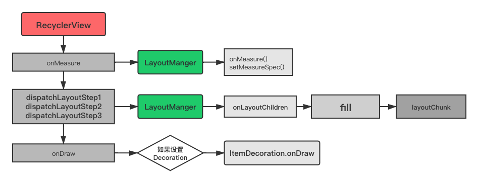

(微信参考地址)[https://mp.weixin.qq.com/s?__biz=MzA3NTYzODYzMg==&mid=2653578065&idx=2&sn=25e64a8bb7b5934cf0ce2e49549a80d6&chksm=84b3b156b3c43840061c28869671da915a25cf3be54891f040a3532e1bb17f9d32e244b79e3f&scene=21#wechat_redirect]

（离屏缓存）[https://mp.weixin.qq.com/s/Qey-3JDdKYG04mo9WeBZ2g]

### 第一次layout

```java
    @Override
    protected void onLayout(boolean changed, int l, int t, int r, int b) {
        TraceCompat.beginSection(TRACE_ON_LAYOUT_TAG);
        dispatchLayout();
        TraceCompat.endSection();
        mFirstLayoutComplete = true;
    }
```

#### dispatchLayout

```java
    void dispatchLayout() {
        if (mAdapter == null) {
            Log.e(TAG, "No adapter attached; skipping layout");
            // leave the state in START
            return;
        }
        if (mLayout == null) {
            Log.e(TAG, "No layout manager attached; skipping layout");
            // leave the state in START
            return;
        }
        mState.mIsMeasuring = false;
        if (mState.mLayoutStep == State.STEP_START) {
            //分发布局的第一个步骤
            dispatchLayoutStep1();
            mLayout.setExactMeasureSpecsFrom(this);
            //分发布局的第二个步骤
            dispatchLayoutStep2();
        } else if (mAdapterHelper.hasUpdates() || mLayout.getWidth() != getWidth()
                || mLayout.getHeight() != getHeight()) {
            mLayout.setExactMeasureSpecsFrom(this);
            //分发布局的第二个步骤
            dispatchLayoutStep2();
        } else {
            // always make sure we sync them (to ensure mode is exact)
            mLayout.setExactMeasureSpecsFrom(this);
        }
        //分发布局的第三个步骤
        dispatchLayoutStep3();
    }
```

1. dispatchLayoutStep1();
    - 处理adapter的数据更新
    - 决定那种动画需要执行
    - 保存当前view的状态（处理一级缓存)
    - 如果需要的话，执行预测的布局，并保存其中的布局信息。
2. dispatchLayoutStep2();
根据设置的layoutManager(我们自己设置的layoutManager)来布置其中的view。
3. dispatchLayoutStep3();
布局的最后一步，在这里我们保存关于视图的动画信息，触发动画并进行任何必要的清理。

也就是说第二个步骤比较重要，我们继续看步骤2中涉及的方法。

```java
   private void dispatchLayoutStep2() {
        eatRequestLayout();
        onEnterLayoutOrScroll();
        mState.assertLayoutStep(State.STEP_LAYOUT | State.STEP_ANIMATIONS);
        mAdapterHelper.consumeUpdatesInOnePass();
        mState.mItemCount = mAdapter.getItemCount();
        mState.mDeletedInvisibleItemCountSincePreviousLayout = 0;

        // 👇注意，执行布局，这里的mLayout与我们设置的LayoutManager有关，
        mState.mInPreLayout = false;
        mLayout.onLayoutChildren(mRecycler, mState);

        mState.mStructureChanged = false;
        mPendingSavedState = null;

        // onLayoutChildren may have caused client code to disable item animations; re-check
        mState.mRunSimpleAnimations = mState.mRunSimpleAnimations && mItemAnimator != null;
        mState.mLayoutStep = State.STEP_ANIMATIONS;
        onExitLayoutOrScroll();
        resumeRequestLayout(false);
    }

```

因为这里的具体布局是与我们设置的layoutManager有关，所以这里以LinearLayoutManager为例。查看其 onLayoutChildren 方法。

```java
  public void onLayoutChildren(RecyclerView.Recycler recycler, RecyclerView.State state) {
        //...省略部分代码
        if (mAnchorInfo.mLayoutFromEnd) {
        //...省略部分代码  
            fill(recycler, mLayoutState, state, false); //👈这里
        //...省略部分代码
        } else {
            //...省略部分代码
            fill(recycler, mLayoutState, state, false);//👈这里
            //...省略部分代码
        }

         //...省略部分代码
        layoutForPredictiveAnimations(recycler, state, startOffset, endOffset);
         //...省略部分代码
    }


    int fill(RecyclerView.Recycler recycler, LayoutState layoutState,
            RecyclerView.State state, boolean stopOnFocusable) {

        //...省略部分代码
        while ((layoutState.mInfinite || remainingSpace > 0) && layoutState.hasMore(state)) {
            layoutChunkResult.resetInternal();
            if (RecyclerView.VERBOSE_TRACING) {
                TraceCompat.beginSection("LLM LayoutChunk");
            }
            //👇这里
            layoutChunk(recycler, state, layoutState, layoutChunkResult);
            //...省略部分代码
            if (!layoutChunkResult.mIgnoreConsumed || layoutState.mScrapList != null
                    || !state.isPreLayout()) {
                layoutState.mAvailable -= layoutChunkResult.mConsumed;
                // we keep a separate remaining space because mAvailable is important for recycling
                //每次循环之后，豆浆remainingSpace减去已消费的size
                remainingSpace -= layoutChunkResult.mConsumed;
            }
             //...省略部分代码  

        }
         //...省略部分代码  
    }

```

解释说明：

- 在 onLayoutChildren 中调用 fill 方法，完成子 View 的测量布局工作；
- 在 fill 方法中通过 while 循环判断是否还有剩余足够空间来绘制一个完整的子 View；
- layoutChunk 方法中是子 View 测量布局的真正实现，每次执行完之后需要重新计算 remainingSpace。

layoutChunk 是一个非常核心的方法，这个方法执行一次就填充一个 ItemView 到 RV，部分代码如下：

```java
    void layoutChunk(RecyclerView.Recycler recycler, RecyclerView.State state,
            LayoutState layoutState, LayoutChunkResult result) {

        View view = layoutState.next(recycler);
        //...省略部分代码  
        RecyclerView.LayoutParams params = (RecyclerView.LayoutParams) view.getLayoutParams();
        if (layoutState.mScrapList == null) {//👈第一处
            if (mShouldReverseLayout == (layoutState.mLayoutDirection
                    == LayoutState.LAYOUT_START)) {
                addView(view);
            } else {
                addView(view, 0);
            }
        } else {
            if (mShouldReverseLayout == (layoutState.mLayoutDirection
                    == LayoutState.LAYOUT_START)) {
                addDisappearingView(view);
            } else {
                addDisappearingView(view, 0);
            }
        }
        measureChildWithMargins(view, 0, 0);//👈第二处
        //...省略部分代码  
        layoutDecoratedWithMargins(view, left, top, right, bottom);//👈第三处
        //...省略部分代码  
    }

```

说明：

- 图中 1 处从缓存（Recycler）中取出子 ItemView，然后调用 addView 或者 addDisappearingView 将子 ItemView 添加到 RV 中。
- 图中 2 处测量被添加的 RV 中的子 ItemView 的宽高。
- 图中 3 处根据所设置的 Decoration、Margins 等所有选项确定子 ItemView 的显示位置。

### onDraw

RecyclerView 的 onDraw() 方法

```java
    public void onDraw(Canvas c) {
        super.onDraw(c);

        final int count = mItemDecorations.size();
        for (int i = 0; i < count; i++) {
            mItemDecorations.get(i).onDraw(c, this, mState);
        }
    }
```

这个方法很简单，如果有添加 ItemDecoration，则循环调用所有的 Decoration 的 onDraw 方法，将其显示。至于所有的子 ItemView 则是通过 Android 渲染机制递归的调用子 ItemView 的 draw 方法显示到屏幕上。

小结：

RV 会将测量 onMeasure 和布局 onLayout 的工作委托给 LayoutManager 来执行，不同的 LayoutManager 会有不同风格的布局显示，这是一种策略模式。用一张图来描述这段过程如下：



#### 缓存复用原理

缓存复用是 RV 中另一个非常重要的机制，这套机制主要实现了 ViewHolder 的缓存以及复用。

核心代码是在 Recycler 中完成的，它是 RV 中的一个内部类，主要用来缓存屏幕内 ViewHolder 以及部分屏幕外 ViewHolder，部分代码如下：

```java
    public final class Recycler {
        final ArrayList<ViewHolder> mAttachedScrap = new ArrayList<>();
        ArrayList<ViewHolder> mChangedScrap = null;
        final ArrayList<ViewHolder> mCachedViews = new ArrayList<ViewHolder>();
        RecycledViewPool mRecyclerPool;
        }
```

Recycler 的缓存机制就是通过上图中的这些数据容器来实现的，实际上 Recycler 的缓存也是分级处理的，根据访问优先级从上到下可以分为 4 级，如下：

- 第一级缓存：mAttachedScrap、mChangedScrap;
- 第二级缓存：mCachedViews
- 第三级缓存：ViewCacheExtension
- 第四级缓存：RecycledViewPool

#### 各级缓存功能

RV 之所以要将缓存分成这么多块，是为了在功能上进行一些区分，并分别对应不同的使用场景。

##### 第一级缓存 mAttachedScrap&mChangedScrap

是两个名为 Scrap 的 ArrayList，这两者主要用来缓存屏幕内的 ViewHolder。为什么屏幕内的 ViewHolder 需要缓存呢？做过 App 开发的应该都熟悉下面的布局场景：

下拉刷新场景：

通过下拉刷新列表中的内容，当刷新被触发时，只需要在原有的 ViewHolder 基础上进行重新绑定新的数据 data 即可，而这些旧的 ViewHolder 就是被保存在 mAttachedScrap 和 mChangedScrap 中。实际上当我们调用 RV 的 notifyXXX 方法时，就会向这两个列表进行填充，将旧 ViewHolder 缓存起来。

##### 第二级缓存 mCachedViews

它用来缓存移除屏幕之外的 ViewHolder，默认情况下缓存个数是 2，不过可以通过 setViewCacheSize 方法来改变缓存的容量大小。如果 mCachedViews 的容量已满，则会根据 FIFO 的规则将旧 ViewHolder 抛弃，然后添加新的 ViewHolder，如下所示：


##### 第三级缓存 ViewCacheExtension

这是 RV 预留给开发人员的一个抽象类，在这个类中只有一个抽象方法，如下：

```java
    public abstract static class ViewCacheExtension {
        @Nullable
        public abstract View getViewForPositionAndType(@NonNull Recycler recycler, int position,
                int type);
    }
```

开发人员可以通过继承 ViewCacheExtension，并复写抽象方法 getViewForPositionAndType 来实现自己的缓存机制。只是一般情况下我们不会自己实现也不建议自己去添加缓存逻辑，因为这个类的使用门槛较高，需要开发人员对 RV 的源码非常熟悉。

#### 第四级缓存 RecycledViewPool

RecycledViewPool 同样是用来缓存屏幕外的 ViewHolder，当 mCachedViews 中的个数已满（默认为 2），则从 mCachedViews 中淘汰出来的 ViewHolder 会先缓存到 RecycledViewPool 中。ViewHolder 在被缓存到 RecycledViewPool 时，会将内部的数据清理，因此从 RecycledViewPool 中取出来的 ViewHolder 需要重新调用 onBindViewHolder 绑定数据。这就同最早的 ListView 中的使用 ViewHolder 复用 convertView 的道理是一致的，因此 RV 也算是将 ListView 的优点完美的继承过来。

RecycledViewPool 还有一个重要功能，官方对其有如下解释：

>RecycledViewPool lets you share Views between multiple RecyclerViews.

可以看出，多个 RV 之间可以共享一个 RecycledViewPool，这对于多 tab 界面的优化效果会很显著。需要注意的是，RecycledViewPool 是根据 type 来获取 ViewHolder，每个 type 默认最大缓存 5 个。因此多个 RecyclerView 共享 RecycledViewPool 时，必须确保共享的 RecyclerView 使用的 Adapter 是同一个，或 view type 是不会冲突的。

#### 具体的缓存过程

在上文介绍 onLayout 阶段时，有介绍在 layoutChunk 方法中通过调用 layoutState.next 方法拿到某个子 ItemView，然后添加到 RV 中。看一下 layoutState.next 的详细代码：

```java
    void layoutChunk(RecyclerView.Recycler recycler, RecyclerView.State state,
            LayoutState layoutState, LayoutChunkResult result) {
        View view = layoutState.next(recycler);
       //...省略部分代码
    }
```

继续跟踪：

```java
        View next(RecyclerView.Recycler recycler) {
            if (mScrapList != null) {
                return nextViewFromScrapList();
            }
            final View view = recycler.getViewForPosition(mCurrentPosition);
            mCurrentPosition += mItemDirection;
            return view;
        }
```

```java
        public View getViewForPosition(int position) {
            return getViewForPosition(position, false);
        }

        View getViewForPosition(int position, boolean dryRun) {
            return tryGetViewHolderForPositionByDeadline(position, dryRun, FOREVER_NS).itemView;
        }
```

可以看出最终调用 tryGetViewHolderForPositionByDeadline 方法来查找相应位置上的 ViewHolder，在这个方法中会从上面介绍的 4 级缓存中依次查找：

```java
        ViewHolder tryGetViewHolderForPositionByDeadline(int position,
                boolean dryRun, long deadlineNs) {
            if (position < 0 || position >= mState.getItemCount()) {
                throw new IndexOutOfBoundsException("Invalid item position " + position
                        + "(" + position + "). Item count:" + mState.getItemCount()
                        + exceptionLabel());
            }
            boolean fromScrapOrHiddenOrCache = false;
            ViewHolder holder = null;
            //第一步，从changed scrap中获取数据
            if (mState.isPreLayout()) {
                holder = getChangedScrapViewForPosition(position);//
                fromScrapOrHiddenOrCache = holder != null;
            }
            //第二步、从 attach scrap,hidden 或者 cache中获取
            if (holder == null) {
                holder = getScrapOrHiddenOrCachedHolderForPosition(position, dryRun);
                if (holder != null) {
                    if (!validateViewHolderForOffsetPosition(holder)) {
                        // recycle holder (and unscrap if relevant) since it can't be used
                        if (!dryRun) {
                            // we would like to recycle this but need to make sure it is not used by
                            // animation logic etc.
                            holder.addFlags(ViewHolder.FLAG_INVALID);
                            if (holder.isScrap()) {
                                removeDetachedView(holder.itemView, false);
                                holder.unScrap();
                            } else if (holder.wasReturnedFromScrap()) {
                                holder.clearReturnedFromScrapFlag();
                            }
                            recycleViewHolderInternal(holder);
                        }
                        holder = null;
                    } else {
                        fromScrapOrHiddenOrCache = true;
                    }
                }
            }
            if (holder == null) {
                final int offsetPosition = mAdapterHelper.findPositionOffset(position);
                if (offsetPosition < 0 || offsetPosition >= mAdapter.getItemCount()) {
                    throw new IndexOutOfBoundsException("Inconsistency detected. Invalid item "
                            + "position " + position + "(offset:" + offsetPosition + ")."
                            + "state:" + mState.getItemCount() + exceptionLabel());
                }

                final int type = mAdapter.getItemViewType(offsetPosition);
                // 第三步、 通过StableId进行获取，针对复写了BaseAdapter的StableId
                if (mAdapter.hasStableIds()) {
                    holder = getScrapOrCachedViewForId(mAdapter.getItemId(offsetPosition),
                            type, dryRun);
                    if (holder != null) {
                        // update position
                        holder.mPosition = offsetPosition;
                        fromScrapOrHiddenOrCache = true;
                    }
                }
                // 第四步、通过mViewCacheExtension来获取。
                if (holder == null && mViewCacheExtension != null) {
                    // We are NOT sending the offsetPosition because LayoutManager does not
                    // know it.
                    final View view = mViewCacheExtension
                            .getViewForPositionAndType(this, position, type);
                    if (view != null) {
                        holder = getChildViewHolder(view);
                        if (holder == null) {
                            throw new IllegalArgumentException("getViewForPositionAndType returned"
                                    + " a view which does not have a ViewHolder"
                                    + exceptionLabel());
                        } else if (holder.shouldIgnore()) {
                            throw new IllegalArgumentException("getViewForPositionAndType returned"
                                    + " a view that is ignored. You must call stopIgnoring before"
                                    + " returning this view." + exceptionLabel());
                        }
                    }
                }
                //第五步、通过RecycledViewPool中获取
                if (holder == null) { // fallback to pool
                    if (DEBUG) {
                        Log.d(TAG, "tryGetViewHolderForPositionByDeadline("
                                + position + ") fetching from shared pool");
                    }
                    holder = getRecycledViewPool().getRecycledView(type);
                    if (holder != null) {
                        holder.resetInternal();
                        if (FORCE_INVALIDATE_DISPLAY_LIST) {
                            invalidateDisplayListInt(holder);
                        }
                    }
                }

                //第六步、如果从缓存中都没有拿到，那么就直接创建。
                if (holder == null) {
                    long start = getNanoTime();
                    if (deadlineNs != FOREVER_NS
                            && !mRecyclerPool.willCreateInTime(type, start, deadlineNs)) {
                        // abort - we have a deadline we can't meet
                        return null;
                    }
                    //👇这里开始创建
                    holder = mAdapter.createViewHolder(RecyclerView.this, type);
                    if (ALLOW_THREAD_GAP_WORK) {
                        // only bother finding nested RV if prefetching
                        RecyclerView innerView = findNestedRecyclerView(holder.itemView);
                        if (innerView != null) {
                            holder.mNestedRecyclerView = new WeakReference<>(innerView);
                        }
                    }

                    long end = getNanoTime();
                    mRecyclerPool.factorInCreateTime(type, end - start);
                    if (DEBUG) {
                        Log.d(TAG, "tryGetViewHolderForPositionByDeadline created new ViewHolder");
                    }
                }
            }

            // This is very ugly but the only place we can grab this information
            // before the View is rebound and returned to the LayoutManager for post layout ops.
            // We don't need this in pre-layout since the VH is not updated by the LM.
            if (fromScrapOrHiddenOrCache && !mState.isPreLayout() && holder
                    .hasAnyOfTheFlags(ViewHolder.FLAG_BOUNCED_FROM_HIDDEN_LIST)) {
                holder.setFlags(0, ViewHolder.FLAG_BOUNCED_FROM_HIDDEN_LIST);
                if (mState.mRunSimpleAnimations) {
                    int changeFlags = ItemAnimator
                            .buildAdapterChangeFlagsForAnimations(holder);
                    changeFlags |= ItemAnimator.FLAG_APPEARED_IN_PRE_LAYOUT;
                    final ItemHolderInfo info = mItemAnimator.recordPreLayoutInformation(mState,
                            holder, changeFlags, holder.getUnmodifiedPayloads());
                    recordAnimationInfoIfBouncedHiddenView(holder, info);
                }
            }

            boolean bound = false;
            if (mState.isPreLayout() && holder.isBound()) {
                // do not update unless we absolutely have to.
                holder.mPreLayoutPosition = position;
            } else if (!holder.isBound() || holder.needsUpdate() || holder.isInvalid()) {
                if (DEBUG && holder.isRemoved()) {
                    throw new IllegalStateException("Removed holder should be bound and it should"
                            + " come here only in pre-layout. Holder: " + holder
                            + exceptionLabel());
                }
                final int offsetPosition = mAdapterHelper.findPositionOffset(position);
                //👇这里设置数据与视图的绑定
                bound = tryBindViewHolderByDeadline(holder, offsetPosition, position, deadlineNs);
            }

            final ViewGroup.LayoutParams lp = holder.itemView.getLayoutParams();
            final LayoutParams rvLayoutParams;
            if (lp == null) {
                rvLayoutParams = (LayoutParams) generateDefaultLayoutParams();
                holder.itemView.setLayoutParams(rvLayoutParams);
            } else if (!checkLayoutParams(lp)) {
                rvLayoutParams = (LayoutParams) generateLayoutParams(lp);
                holder.itemView.setLayoutParams(rvLayoutParams);
            } else {
                rvLayoutParams = (LayoutParams) lp;
            }
            rvLayoutParams.mViewHolder = holder;
            rvLayoutParams.mPendingInvalidate = fromScrapOrHiddenOrCache && bound;
            return holder;
        }

```

整个获取缓存的步骤：

- 第一步，从changed scrap中获取数据
- 第二步、从 attach scrap,hidden 或者 cache中获取
- 第三步、通过StableId进行获取，针对复写了BaseAdapter的StableId
- 第四步、通过mViewCacheExtension来获取。
- 第五步、通过RecycledViewPool中获取
- 第六步、如果从缓存中都没有拿到，那么就直接创建。

第二步中的方法。getScrapOrHiddenOrCachedHolderForPosition需要注意

```java
        ViewHolder getScrapOrHiddenOrCachedHolderForPosition(int position, boolean dryRun) {
            final int scrapCount = mAttachedScrap.size();

            // Try first for an exact, non-invalid match from scrap.
            for (int i = 0; i < scrapCount; i++) {
                final ViewHolder holder = mAttachedScrap.get(i);
                if (!holder.wasReturnedFromScrap() && holder.getLayoutPosition() == position
                        && !holder.isInvalid() && (mState.mInPreLayout || !holder.isRemoved())) {
                    holder.addFlags(ViewHolder.FLAG_RETURNED_FROM_SCRAP);
                    return holder;
                }
            }

            if (!dryRun) {
                //默认是false，也就是如果当前view是hidden的话，默认会加入attachScrap中的
                View view = mChildHelper.findHiddenNonRemovedView(position);
                if (view != null) {
                    // This View is good to be used. We just need to unhide, detach and move to the
                    // scrap list.
                    final ViewHolder vh = getChildViewHolderInt(view);
                    mChildHelper.unhide(view);
                    int layoutIndex = mChildHelper.indexOfChild(view);
                    if (layoutIndex == RecyclerView.NO_POSITION) {
                        throw new IllegalStateException("layout index should not be -1 after "
                                + "unhiding a view:" + vh + exceptionLabel());
                    }
                    mChildHelper.detachViewFromParent(layoutIndex);
                    //👇这里注意开始缓存了
                    scrapView(view);
                    vh.addFlags(ViewHolder.FLAG_RETURNED_FROM_SCRAP
                            | ViewHolder.FLAG_BOUNCED_FROM_HIDDEN_LIST);
                    return vh;
                }
            }

            // Search in our first-level recycled view cache.
            final int cacheSize = mCachedViews.size();
            for (int i = 0; i < cacheSize; i++) {
                final ViewHolder holder = mCachedViews.get(i);
                // invalid view holders may be in cache if adapter has stable ids as they can be
                // retrieved via getScrapOrCachedViewForId
                if (!holder.isInvalid() && holder.getLayoutPosition() == position) {
                    if (!dryRun) {
                        mCachedViews.remove(i);
                    }
                    if (DEBUG) {
                        Log.d(TAG, "getScrapOrHiddenOrCachedHolderForPosition(" + position
                                + ") found match in cache: " + holder);
                    }
                    return holder;
                }
            }
            return null;
        }
```

继续查看 scrapView 方法：

```java
        void scrapView(View view) {
            final ViewHolder holder = getChildViewHolderInt(view);
            if (holder.hasAnyOfTheFlags(ViewHolder.FLAG_REMOVED | ViewHolder.FLAG_INVALID)
                    || !holder.isUpdated() || canReuseUpdatedViewHolder(holder)) {
                if (holder.isInvalid() && !holder.isRemoved() && !mAdapter.hasStableIds()) {
                    throw new IllegalArgumentException("Called scrap view with an invalid view."
                            + " Invalid views cannot be reused from scrap, they should rebound from"
                            + " recycler pool." + exceptionLabel());
                }
                //👇这里开始缓存
                holder.setScrapContainer(this, false);
                mAttachedScrap.add(holder);
            } else {
                if (mChangedScrap == null) {
                    mChangedScrap = new ArrayList<ViewHolder>();
                }
                //👇这里开始缓存
                holder.setScrapContainer(this, true);
                mChangedScrap.add(holder);
            }
        }
```

### 滑动的时候回收数据

```java
   public boolean onTouchEvent(MotionEvent e) {
        if (mLayoutFrozen || mIgnoreMotionEventTillDown) {
            return false;
        }
        if (dispatchOnItemTouch(e)) {
            cancelTouch();
            return true;
        }

        if (mLayout == null) {
            return false;
        }

        final boolean canScrollHorizontally = mLayout.canScrollHorizontally();
        final boolean canScrollVertically = mLayout.canScrollVertically();

        if (mVelocityTracker == null) {
            mVelocityTracker = VelocityTracker.obtain();
        }
        boolean eventAddedToVelocityTracker = false;

        final MotionEvent vtev = MotionEvent.obtain(e);
        final int action = e.getActionMasked();
        final int actionIndex = e.getActionIndex();

        if (action == MotionEvent.ACTION_DOWN) {
            mNestedOffsets[0] = mNestedOffsets[1] = 0;
        }
        vtev.offsetLocation(mNestedOffsets[0], mNestedOffsets[1]);

        switch (action) {
            case MotionEvent.ACTION_DOWN: {
                mScrollPointerId = e.getPointerId(0);
                mInitialTouchX = mLastTouchX = (int) (e.getX() + 0.5f);
                mInitialTouchY = mLastTouchY = (int) (e.getY() + 0.5f);

                int nestedScrollAxis = ViewCompat.SCROLL_AXIS_NONE;
                if (canScrollHorizontally) {
                    nestedScrollAxis |= ViewCompat.SCROLL_AXIS_HORIZONTAL;
                }
                if (canScrollVertically) {
                    nestedScrollAxis |= ViewCompat.SCROLL_AXIS_VERTICAL;
                }
                startNestedScroll(nestedScrollAxis, TYPE_TOUCH);
            } break;

            case MotionEvent.ACTION_POINTER_DOWN: {
                mScrollPointerId = e.getPointerId(actionIndex);
                mInitialTouchX = mLastTouchX = (int) (e.getX(actionIndex) + 0.5f);
                mInitialTouchY = mLastTouchY = (int) (e.getY(actionIndex) + 0.5f);
            } break;

            case MotionEvent.ACTION_MOVE: {
                final int index = e.findPointerIndex(mScrollPointerId);
                if (index < 0) {
                    Log.e(TAG, "Error processing scroll; pointer index for id "
                            + mScrollPointerId + " not found. Did any MotionEvents get skipped?");
                    return false;
                }

                final int x = (int) (e.getX(index) + 0.5f);
                final int y = (int) (e.getY(index) + 0.5f);
                int dx = mLastTouchX - x;
                int dy = mLastTouchY - y;

                if (dispatchNestedPreScroll(dx, dy, mScrollConsumed, mScrollOffset, TYPE_TOUCH)) {
                    dx -= mScrollConsumed[0];
                    dy -= mScrollConsumed[1];
                    vtev.offsetLocation(mScrollOffset[0], mScrollOffset[1]);
                    // Updated the nested offsets
                    mNestedOffsets[0] += mScrollOffset[0];
                    mNestedOffsets[1] += mScrollOffset[1];
                }

                if (mScrollState != SCROLL_STATE_DRAGGING) {
                    boolean startScroll = false;
                    if (canScrollHorizontally && Math.abs(dx) > mTouchSlop) {
                        if (dx > 0) {
                            dx -= mTouchSlop;
                        } else {
                            dx += mTouchSlop;
                        }
                        startScroll = true;
                    }
                    if (canScrollVertically && Math.abs(dy) > mTouchSlop) {
                        if (dy > 0) {
                            dy -= mTouchSlop;
                        } else {
                            dy += mTouchSlop;
                        }
                        startScroll = true;
                    }
                    if (startScroll) {
                        setScrollState(SCROLL_STATE_DRAGGING);
                    }
                }

                if (mScrollState == SCROLL_STATE_DRAGGING) {
                    mLastTouchX = x - mScrollOffset[0];
                    mLastTouchY = y - mScrollOffset[1];

                    if (scrollByInternal(
                            canScrollHorizontally ? dx : 0,
                            canScrollVertically ? dy : 0,
                            vtev)) {
                        getParent().requestDisallowInterceptTouchEvent(true);
                    }
                    //我们只用关心滑动的预先加载数据
                    if (mGapWorker != null && (dx != 0 || dy != 0)) {
                        mGapWorker.postFromTraversal(this, dx, dy);
                    }
                }
            } break;

            case MotionEvent.ACTION_POINTER_UP: {
                onPointerUp(e);
            } break;

            case MotionEvent.ACTION_UP: {
                mVelocityTracker.addMovement(vtev);
                eventAddedToVelocityTracker = true;
                mVelocityTracker.computeCurrentVelocity(1000, mMaxFlingVelocity);
                final float xvel = canScrollHorizontally
                        ? -mVelocityTracker.getXVelocity(mScrollPointerId) : 0;
                final float yvel = canScrollVertically
                        ? -mVelocityTracker.getYVelocity(mScrollPointerId) : 0;
                if (!((xvel != 0 || yvel != 0) && fling((int) xvel, (int) yvel))) {
                    setScrollState(SCROLL_STATE_IDLE);
                }
                resetTouch();
            } break;

            case MotionEvent.ACTION_CANCEL: {
                cancelTouch();
            } break;
        }

        if (!eventAddedToVelocityTracker) {
            mVelocityTracker.addMovement(vtev);
        }
        vtev.recycle();

        return true;
    }
```

因为会涉及到GapWorker类，

```java
    void postFromTraversal(RecyclerView recyclerView, int prefetchDx, int prefetchDy) {
        if (recyclerView.isAttachedToWindow()) {
            if (RecyclerView.DEBUG && !mRecyclerViews.contains(recyclerView)) {
                throw new IllegalStateException("attempting to post unregistered view!");
            }
            if (mPostTimeNs == 0) {
                mPostTimeNs = recyclerView.getNanoTime();
                recyclerView.post(this);
            }
        }

        recyclerView.mPrefetchRegistry.setPrefetchVector(prefetchDx, prefetchDy);
    }

```

因为GapWorker实现了Runnable接口

```java
    public void run() {
        try {
            TraceCompat.beginSection(RecyclerView.TRACE_PREFETCH_TAG);

            if (mRecyclerViews.isEmpty()) {
                // abort - no work to do
                return;
            }

            // Query most recent vsync so we can predict next one. Note that drawing time not yet
            // valid in animation/input callbacks, so query it here to be safe.
            final int size = mRecyclerViews.size();
            long latestFrameVsyncMs = 0;
            for (int i = 0; i < size; i++) {
                RecyclerView view = mRecyclerViews.get(i);
                if (view.getWindowVisibility() == View.VISIBLE) {
                    latestFrameVsyncMs = Math.max(view.getDrawingTime(), latestFrameVsyncMs);
                }
            }

            if (latestFrameVsyncMs == 0) {
                // abort - either no views visible, or couldn't get last vsync for estimating next
                return;
            }

            long nextFrameNs = TimeUnit.MILLISECONDS.toNanos(latestFrameVsyncMs) + mFrameIntervalNs;
            //注意这里，会预先加载
            prefetch(nextFrameNs);

            // TODO: consider rescheduling self, if there's more work to do
        } finally {
            mPostTimeNs = 0;
            TraceCompat.endSection();
        }
    }
```

涉及prefetch()方法，又因为内部调用了flushTasksWithDeadline（）方法，所以我们直接看该方法。

```java
    private RecyclerView.ViewHolder prefetchPositionWithDeadline(RecyclerView view,
            int position, long deadlineNs) {
        if (isPrefetchPositionAttached(view, position)) {
            // don't attempt to prefetch attached views
            return null;
        }

        RecyclerView.Recycler recycler = view.mRecycler;
        RecyclerView.ViewHolder holder;
        try {
            view.onEnterLayoutOrScroll();
            //这里又会从缓存中获取数据
            holder = recycler.tryGetViewHolderForPositionByDeadline(
                    position, false, deadlineNs);

            if (holder != null) {
                //如果当前数据与视图已经关联，且当前数据是有效的，那么就会通过recycleView方法缓存数据
                if (holder.isBound() && !holder.isInvalid()) {
                    // Only give the view a chance to go into the cache if binding succeeded
                    // Note that we must use public method, since item may need cleanup
                    recycler.recycleView(holder.itemView);
                } else {//否则会直接将视图放入RecycledPool中
                    // Didn't bind, so we can't cache the view, but it will stay in the pool until
                    // next prefetch/traversal. If a View fails to bind, it means we didn't have
                    // enough time prior to the deadline (and won't for other instances of this
                    // type, during this GapWorker prefetch pass).
                    recycler.addViewHolderToRecycledViewPool(holder, false);
                }
            }
        } finally {
            view.onExitLayoutOrScroll(false);
        }
        return holder;
    }

```

#### 缓存策略

我们继续查看recycleView（）方法的缓存view的策略

```java
        public void recycleView(View view) {
            // This public recycle method tries to make view recycle-able since layout manager
            // intended to recycle this view (e.g. even if it is in scrap or change cache)
            ViewHolder holder = getChildViewHolderInt(view);
            //如果当前视图从RecyclerView中不可见，那么就将视图从RecyclerView中移除
            if (holder.isTmpDetached()) {
                removeDetachedView(view, false);
            }
            //如果当前视图已经缓存过了，那么就从缓存中删除。
            if (holder.isScrap()) {
                holder.unScrap();
            } else if (holder.wasReturnedFromScrap()) {
                holder.clearReturnedFromScrapFlag();
            }
            recycleViewHolderInternal(holder);
        }
```

```java
        void recycleViewHolderInternal(ViewHolder holder) {
            if (holder.isScrap() || holder.itemView.getParent() != null) {
                throw new IllegalArgumentException(
                        "Scrapped or attached views may not be recycled. isScrap:"
                                + holder.isScrap() + " isAttached:"
                                + (holder.itemView.getParent() != null) + exceptionLabel());
            }

            if (holder.isTmpDetached()) {
                throw new IllegalArgumentException("Tmp detached view should be removed "
                        + "from RecyclerView before it can be recycled: " + holder
                        + exceptionLabel());
            }

            if (holder.shouldIgnore()) {
                throw new IllegalArgumentException("Trying to recycle an ignored view holder. You"
                        + " should first call stopIgnoringView(view) before calling recycle."
                        + exceptionLabel());
            }
            //noinspection unchecked
            final boolean transientStatePreventsRecycling = holder
                    .doesTransientStatePreventRecycling();
            final boolean forceRecycle = mAdapter != null
                    && transientStatePreventsRecycling
                    && mAdapter.onFailedToRecycleView(holder);
            boolean cached = false;
            boolean recycled = false;
            if (DEBUG && mCachedViews.contains(holder)) {
                throw new IllegalArgumentException("cached view received recycle internal? "
                        + holder + exceptionLabel());
            }

            if (forceRecycle || holder.isRecyclable()) {
                if (mViewCacheMax > 0
                        && !holder.hasAnyOfTheFlags(ViewHolder.FLAG_INVALID
                        | ViewHolder.FLAG_REMOVED
                        | ViewHolder.FLAG_UPDATE
                        | ViewHolder.FLAG_ADAPTER_POSITION_UNKNOWN)) {
                    // 判断当前cach中的数据是否超过最大值（2），如果超过，那么就移除最早的数据。
                    int cachedViewSize = mCachedViews.size();
                    if (cachedViewSize >= mViewCacheMax && cachedViewSize > 0) {
                        recycleCachedViewAt(0);
                        cachedViewSize--;
                    }

                    int targetCacheIndex = cachedViewSize;

                    //这里在sdk21以上ui线程将帧传给渲染线程时，在下一帧渲染之前是有空闲时间的，我们就可以在这个时候进行预取操作
                    //如果说上次预先加载的已经在cache缓存了，那么会直接放入RecycledPool中
                    if (ALLOW_THREAD_GAP_WORK
                            && cachedViewSize > 0
                            && !mPrefetchRegistry.lastPrefetchIncludedPosition(holder.mPosition)) {
                        // when adding the view, skip past most recently prefetched views
                        int cacheIndex = cachedViewSize - 1;
                        while (cacheIndex >= 0) {
                            int cachedPos = mCachedViews.get(cacheIndex).mPosition;
                            if (!mPrefetchRegistry.lastPrefetchIncludedPosition(cachedPos)) {
                                break;
                            }
                            cacheIndex--;
                        }
                        targetCacheIndex = cacheIndex + 1;
                    }
                    //将数据添加到Recycler的cache中区
                    mCachedViews.add(targetCacheIndex, holder);
                    cached = true;
                }
                //如果不能通过Recycler的cache缓存数据，那么就放入RecycledPool中
                if (!cached) {
                    addViewHolderToRecycledViewPool(holder, true);
                    recycled = true;
                }
            } else {
                // NOTE: A view can fail to be recycled when it is scrolled off while an animation
                // runs. In this case, the item is eventually recycled by
                // ItemAnimatorRestoreListener#onAnimationFinished.

                // TODO: consider cancelling an animation when an item is removed scrollBy,
                // to return it to the pool faster
                if (DEBUG) {
                    Log.d(TAG, "trying to recycle a non-recycleable holder. Hopefully, it will "
                            + "re-visit here. We are still removing it from animation lists"
                            + exceptionLabel());
                }
            }
            // even if the holder is not removed, we still call this method so that it is removed
            // from view holder lists.
            mViewInfoStore.removeViewHolder(holder);
            if (!cached && !recycled && transientStatePreventsRecycling) {
                holder.mOwnerRecyclerView = null;
            }
        }

```

默认预去状态下会将下一个view的数据绑定，也就是会将预先取得的数据放入Recycle中的Scrap与Cache中，如果不能通过Recycler的cache缓存数据，那么就放入RecycledPool中。

### 屏幕中不可见

onTouchEvent方法 在滑动的时候，会将移除屏幕外的 ViewHolder进行回收。

```java

            case MotionEvent.ACTION_MOVE: {
                final int index = e.findPointerIndex(mScrollPointerId);
                if (index < 0) {
                    Log.e(TAG, "Error processing scroll; pointer index for id "
                            + mScrollPointerId + " not found. Did any MotionEvents get skipped?");
                    return false;
                }

                final int x = (int) (e.getX(index) + 0.5f);
                final int y = (int) (e.getY(index) + 0.5f);
                int dx = mLastTouchX - x;
                int dy = mLastTouchY - y;

                if (dispatchNestedPreScroll(dx, dy, mScrollConsumed, mScrollOffset, TYPE_TOUCH)) {
                    dx -= mScrollConsumed[0];
                    dy -= mScrollConsumed[1];
                    vtev.offsetLocation(mScrollOffset[0], mScrollOffset[1]);
                    // Updated the nested offsets
                    mNestedOffsets[0] += mScrollOffset[0];
                    mNestedOffsets[1] += mScrollOffset[1];
                }

                if (mScrollState != SCROLL_STATE_DRAGGING) {
                    boolean startScroll = false;
                    if (canScrollHorizontally && Math.abs(dx) > mTouchSlop) {
                        if (dx > 0) {
                            dx -= mTouchSlop;
                        } else {
                            dx += mTouchSlop;
                        }
                        startScroll = true;
                    }
                    if (canScrollVertically && Math.abs(dy) > mTouchSlop) {
                        if (dy > 0) {
                            dy -= mTouchSlop;
                        } else {
                            dy += mTouchSlop;
                        }
                        startScroll = true;
                    }
                    if (startScroll) {
                        setScrollState(SCROLL_STATE_DRAGGING);
                    }
                }

                if (mScrollState == SCROLL_STATE_DRAGGING) {
                    mLastTouchX = x - mScrollOffset[0];
                    mLastTouchY = y - mScrollOffset[1];
                    //👇注意这里
                    if (scrollByInternal(
                            canScrollHorizontally ? dx : 0,
                            canScrollVertically ? dy : 0,
                            vtev)) {
                        getParent().requestDisallowInterceptTouchEvent(true);
                    }
                    if (mGapWorker != null && (dx != 0 || dy != 0)) {
                        mGapWorker.postFromTraversal(this, dx, dy);
                    }
                }
            } break;
```

```java
    boolean scrollByInternal(int x, int y, MotionEvent ev) {
        int unconsumedX = 0, unconsumedY = 0;
        int consumedX = 0, consumedY = 0;

        consumePendingUpdateOperations();
        if (mAdapter != null) {
            startInterceptRequestLayout();
            onEnterLayoutOrScroll();
            TraceCompat.beginSection(TRACE_SCROLL_TAG);
            fillRemainingScrollValues(mState);
            if (x != 0) {
                consumedX = mLayout.scrollHorizontallyBy(x, mRecycler, mState);
                unconsumedX = x - consumedX;
            }
            if (y != 0) {
                //👇这里
                consumedY = mLayout.scrollVerticallyBy(y, mRecycler, mState);
                unconsumedY = y - consumedY;
            }
            TraceCompat.endSection();
            repositionShadowingViews();
            onExitLayoutOrScroll();
            stopInterceptRequestLayout(false);
        }
       //省略部分代码
    }

```

以LinearLayoutManager为例子

```java
    public int scrollVerticallyBy(int dy, RecyclerView.Recycler recycler,
            RecyclerView.State state) {
        if (mOrientation == HORIZONTAL) {
            return 0;
        }
        return scrollBy(dy, recycler, state);
    }
```

```java
    int scrollBy(int dy, RecyclerView.Recycler recycler, RecyclerView.State state) {
        if (getChildCount() == 0 || dy == 0) {
            return 0;
        }
        mLayoutState.mRecycle = true;
        ensureLayoutState();
        final int layoutDirection = dy > 0 ? LayoutState.LAYOUT_END : LayoutState.LAYOUT_START;
        final int absDy = Math.abs(dy);
        updateLayoutState(layoutDirection, absDy, true, state);
        //注意这里
        final int consumed = mLayoutState.mScrollingOffset
                + fill(recycler, mLayoutState, state, false);
        if (consumed < 0) {
            if (DEBUG) {
                Log.d(TAG, "Don't have any more elements to scroll");
            }
            return 0;
        }
        final int scrolled = absDy > consumed ? layoutDirection * consumed : dy;
        mOrientationHelper.offsetChildren(-scrolled);
        if (DEBUG) {
            Log.d(TAG, "scroll req: " + dy + " scrolled: " + scrolled);
        }
        mLayoutState.mLastScrollDelta = scrolled;
        return scrolled;
    }
```

```java
    int fill(RecyclerView.Recycler recycler, LayoutState layoutState,
            RecyclerView.State state, boolean stopOnFocusable) {
        // max offset we should set is mFastScroll + available
        final int start = layoutState.mAvailable;
        if (layoutState.mScrollingOffset != LayoutState.SCROLLING_OFFSET_NaN) {
            // TODO ugly bug fix. should not happen
            if (layoutState.mAvailable < 0) {
                layoutState.mScrollingOffset += layoutState.mAvailable;
            }
            recycleByLayoutState(recycler, layoutState);
        }
        int remainingSpace = layoutState.mAvailable + layoutState.mExtra;
        LayoutChunkResult layoutChunkResult = mLayoutChunkResult;
        while ((layoutState.mInfinite || remainingSpace > 0) && layoutState.hasMore(state)) {
            layoutChunkResult.resetInternal();
            if (VERBOSE_TRACING) {
                TraceCompat.beginSection("LLM LayoutChunk");
            }
            layoutChunk(recycler, state, layoutState, layoutChunkResult);
            if (VERBOSE_TRACING) {
                TraceCompat.endSection();
            }
            if (layoutChunkResult.mFinished) {
                break;
            }
            layoutState.mOffset += layoutChunkResult.mConsumed * layoutState.mLayoutDirection;
            /**
             * Consume the available space if:
             * * layoutChunk did not request to be ignored
             * * OR we are laying out scrap children
             * * OR we are not doing pre-layout
             */
            if (!layoutChunkResult.mIgnoreConsumed || mLayoutState.mScrapList != null
                    || !state.isPreLayout()) {
                layoutState.mAvailable -= layoutChunkResult.mConsumed;
                // we keep a separate remaining space because mAvailable is important for recycling
                remainingSpace -= layoutChunkResult.mConsumed;
            }

            //这里开始回收
            if (layoutState.mScrollingOffset != LayoutState.SCROLLING_OFFSET_NaN) {
                layoutState.mScrollingOffset += layoutChunkResult.mConsumed;
                if (layoutState.mAvailable < 0) {
                    layoutState.mScrollingOffset += layoutState.mAvailable;
                }
                recycleByLayoutState(recycler, layoutState);
            }
            if (stopOnFocusable && layoutChunkResult.mFocusable) {
                break;
            }
        }
        if (DEBUG) {
            validateChildOrder();
        }
        return start - layoutState.mAvailable;
    }
```

```java
    private void recycleByLayoutState(RecyclerView.Recycler recycler, LayoutState layoutState) {
        if (!layoutState.mRecycle || layoutState.mInfinite) {
            return;
        }
        if (layoutState.mLayoutDirection == LayoutState.LAYOUT_START) {
            recycleViewsFromEnd(recycler, layoutState.mScrollingOffset);
        } else {
            recycleViewsFromStart(recycler, layoutState.mScrollingOffset);
        }
    }
```

```java
    private void recycleViewsFromStart(RecyclerView.Recycler recycler, int dt) {
        if (dt < 0) {
            if (DEBUG) {
                Log.d(TAG, "Called recycle from start with a negative value. This might happen"
                        + " during layout changes but may be sign of a bug");
            }
            return;
        }
        // ignore padding, ViewGroup may not clip children.
        final int limit = dt;
        final int childCount = getChildCount();
        if (mShouldReverseLayout) {
            for (int i = childCount - 1; i >= 0; i--) {
                View child = getChildAt(i);
                if (mOrientationHelper.getDecoratedEnd(child) > limit
                        || mOrientationHelper.getTransformedEndWithDecoration(child) > limit) {
                    // stop here
                    recycleChildren(recycler, childCount - 1, i);
                    return;
                }
            }
        } else {
            for (int i = 0; i < childCount; i++) {
                View child = getChildAt(i);
                if (mOrientationHelper.getDecoratedEnd(child) > limit
                        || mOrientationHelper.getTransformedEndWithDecoration(child) > limit) {
                    // stop here
                    recycleChildren(recycler, 0, i);
                    return;
                }
            }
        }
    }
```

```java
    private void recycleChildren(RecyclerView.Recycler recycler, int startIndex, int endIndex) {
        if (startIndex == endIndex) {
            return;
        }
        if (DEBUG) {
            Log.d(TAG, "Recycling " + Math.abs(startIndex - endIndex) + " items");
        }
        if (endIndex > startIndex) {
            for (int i = endIndex - 1; i >= startIndex; i--) {
                removeAndRecycleViewAt(i, recycler);
            }
        } else {
            for (int i = startIndex; i > endIndex; i--) {
                removeAndRecycleViewAt(i, recycler);
            }
        }
    }
```

//也就是这里会回收。

```java
        public void removeAndRecycleViewAt(int index, Recycler recycler) {
            final View view = getChildAt(index);
            removeViewAt(index);
            recycler.recycleView(view);
        }

```

### 总结
