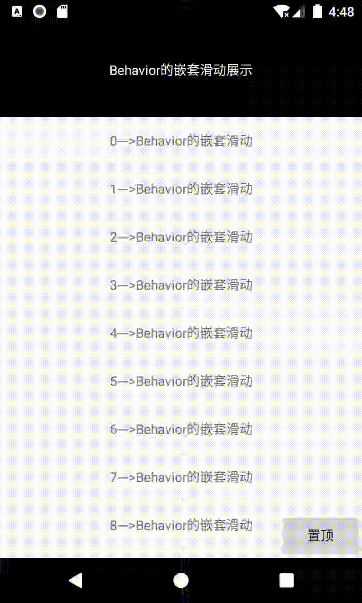

### 前言

在上篇文章中，我们介绍了CoordainatorLayout下的Behavior机制，为了帮助大家更好的理解并运用Behavior，现在我们通过一个Demo，来巩固我们之前学习的知识点。

> 该博客中涉及到的示例，在[NestedScrollingDemo](https://github.com/AndyJennifer/NestedScrollingDemo)项目中都有实现，大家可以按需自取。

### 效果展示

先看一下我们需要实现的效果吧，如下图所示：



**友情提示**：Demo中涉及到的控件为CoordinatorLayout、TextView、RecyclerView。文章都会围绕这三个控件进行讲解。

从Demo效果来看，这是非常简单的嵌套滑动。如果采用我们之前所学的`NestedScrollingParent2`与`NestedScrollingChild2`实现接口的方式。我们能非常迅速的解决问题。但是如果采用自定义Behavior的话，那么就稍微有点难度了。不过不用担心，只要一步一步慢慢分析，就总能解决问题的。

### RecyclerView布局与测量的分析

在Demo中，RecyclerView与TextView开始的布局关系如下图所示：

{% asset_img 例子展示.gif}

根据在文章中我们所学的知识点，我们知道CoordinatorLayout对子控件的布局是类似于FrameLayout的，所以为了保证RecyclerView在TextView的下方显示，我们需要创建属于RecyclerView的Behavior，并在该Behavior的`onLayoutChild`方法中处理RecyclerView与TextView的位置关系。

除了解决RecyclerView的位置关系以外，在该Demo中，我们还可以看出，RecyclerView与TextView之间有着一个联动的关系（这里指的是RecyclerView与TextView之间的位置关系，而不是RecyclerView中的内容)。随着TextView逐渐上移的时候，下方的RecyclerView也跟着往上移动。那么我们可以确定的是RecyclerView必然是依赖TextView的。也就是说我们需要重写Behavior的`layoutDependsOn`与`onDependentViewChanged`方法。

>确定一个控件（childView1)依赖另外一个控件(childView2)的时候，是通过`layoutDependsOn(CoordinatorLayout parent, V child, View dependency)`这个方法。其中child是依赖对象(childView1)，而dependency是被依赖对象(childView2)，该方法的返回值是判断是否依赖对应view。如果返回true。那么表示依赖。反之不依赖。一般情况下，在我们自定义Behavior时，我们需要重写该方法。当`layoutDependsOn`方法返回true时，后面的`onDependentViewChanged`与`onDependentViewRemoved`方法才会调用。

除了考虑以上因数以外，我们还需要考虑RecyclerView的高度。观察Demo，我们可以看出，RecylerView在移动前后，始终都是填充整个屏幕的。为了保证RecylerView在移动过程中，屏幕中不会出现空白（如下图所示）。我们也需要在CoordinatorLayout测量该控件的高度之前，让控件自主的去测量高度。也就是重写RecylerView对应Behavior中的`onMeasureChild`方法。



#### RecyclerView的Behavior代码实现

分析了RecyclerView的Behavior需要重写的内容后，我们来看看具体的Behavior实现类`HeaderScrollingViewBehavior`。代码如下所示：

```java
public class HeaderScrollingViewBehavior extends CoordinatorLayout.Behavior<View> {

    public HeaderScrollingViewBehavior() {}

    public HeaderScrollingViewBehavior(Context context, AttributeSet attrs) {
        super(context, attrs);
    }

    /**
     * 依赖TextView
     */
    @Override
    public boolean layoutDependsOn(CoordinatorLayout parent, View child, View dependency) {
        return dependency instanceof TextView;
    }
}
```

>注意：在xml引用自定义Behavior时，一定要重新构造函数。不然会提示知道不到相应的Behavior。

为了帮助大家理解，我将RecyclerView的Behavior拆成了几个部分，首先我们查看`layoutDependsOn`方法。非常简单，就是判断依赖的对象是否是TextView。我们继续查看该类中的`onMeasureChild`方法。代码如下所示：

```java
@Override
    public boolean onMeasureChild(CoordinatorLayout parent, View child, int parentWidthMeasureSpec, int widthUsed, int parentHeightMeasureSpec, int heightUsed) {

        //获取当前滚动控件的测量模式
        final int childLpHeight = child.getLayoutParams().height;

        //只有当前滚动控件为match_parent/wrap_content时才重新测量其高度，因为固定高度不会出现底部空白的情况
        if (childLpHeight == ViewGroup.LayoutParams.MATCH_PARENT
                || childLpHeight == ViewGroup.LayoutParams.WRAP_CONTENT) {

            //获取当前child依赖的对象集合
            final List<View> dependencies = parent.getDependencies(child);

            final View header = findFirstDependency(dependencies);
            if (header != null) {
                if (ViewCompat.getFitsSystemWindows(header)
                        && !ViewCompat.getFitsSystemWindows(child)) {
                    // If the header is fitting system windows then we need to also,
                    // otherwise we'll get CoL's compatible measuring
                    ViewCompat.setFitsSystemWindows(child, true);

                    if (ViewCompat.getFitsSystemWindows(child)) {
                        // If the set succeeded, trigger a new layout and return true
                        child.requestLayout();
                        return true;
                    }
                }
                //获取当前父控件中可用的距离，
                int availableHeight = View.MeasureSpec.getSize(parentHeightMeasureSpec);
                if (availableHeight == 0) {

                    // If the measure spec doesn't specify a size, use the current height
                    availableHeight = parent.getHeight();
                }
                //计算当前滚动控件的高度。
                final int height = availableHeight - header.getMeasuredHeight() + getScrollRange(header);
                final int heightMeasureSpec = View.MeasureSpec.makeMeasureSpec(height,
                        childLpHeight == ViewGroup.LayoutParams.MATCH_PARENT
                                ? View.MeasureSpec.EXACTLY
                                : View.MeasureSpec.AT_MOST);

                //测量当前滚动的View的正确高度
                parent.onMeasureChild(child, parentWidthMeasureSpec,
                        widthUsed, heightMeasureSpec, heightUsed);

                return true;
            }
        }
        return false;
    }
```

>重新设置控件的位置，我们可以使用View.setTransationY或View.offsetTopAndBottom或其他改变位置的方式。本文例子中的代码采用offsetTopAndBottom的方式来处理上下的移动。

```java
      @Override
    public boolean onLayoutChild(CoordinatorLayout parent, View child, int layoutDirection) {
        final List<View> dependencies = parent.getDependencies(child);
        final View header = findFirstDependency(dependencies);

        if (header != null) {
            final CoordinatorLayout.LayoutParams lp =
                    (CoordinatorLayout.LayoutParams) child.getLayoutParams();
            final Rect available = mTempRect1;

            //设置当前的宽高 为当前header的下方
            available.set(parent.getPaddingLeft() + lp.leftMargin,
                    header.getBottom() + lp.topMargin,
                    parent.getWidth() - parent.getPaddingRight() - lp.rightMargin,
                    parent.getHeight() + header.getBottom()
                            - parent.getPaddingBottom() - lp.bottomMargin);

            //根据gravity重新计算坐标
            final Rect out = mTempRect2;
            GravityCompat.apply(resolveGravity(lp.gravity), child.getMeasuredWidth(),
                    child.getMeasuredHeight(), available, out, layoutDirection);

            //拿到坐标后重新布局
            child.layout(out.left, out.top, out.right, out.bottom);

        } else {
            //如果没有依赖，则调用父控件来处理布局
            parent.onLayoutChild(child, layoutDirection);
        }
        return true;
    }
```

### TextView嵌套滑动的分析

在分析了布局与测量后，我们继续分析嵌套滑动效果，整个嵌套滑动效果并不复杂，分为向上、向下两个效果。

- 向上滑动：
只有当TextView滑动至屏幕外时，RecyclerView才能处理内部内容的滚动。
- 向下滑动：
当TextView已经被划出屏幕且RecylerView中的内容不能继续向下滑动时，那么就将TextView滑动至显示。否则RecyclerView单独处理内部内容的滚动

#### TextView的Behavior代码实现

在讲解嵌套滑动效果之前，我们需要回顾一下Behavior实现嵌套滑动的原理与过程，如下图所示：

-CoordinatorLayout与Behavior/嵌套滑动整体流程.jpg)

>文章中不会介绍Behavior嵌套滑动相关方法的作用，如果需要了解这些方法的作用，建议参看文章下的方法介绍。

回顾之前讲解的知识，如果我们的控件想要实现嵌套滑动，我们需要重写Behavior的相关方法。根据本文例子中展示的效果，我们需要自定义Behavior，并重写其`onStartNestedScroll`与`onNestedPreScroll`和`onNestedScroll`三个方法。

```java
public class NestedHeaderBehavior extends CoordinatorLayout.Behavior<View> {


    private WeakReference<View> mNestedScrollingChildRef;
    private int mOffset;//记录当前布局的偏移量

    public NestedHeaderBehavior(Context context, AttributeSet attrs) {
        super(context, attrs);
    }

    @Override
    public boolean onLayoutChild(CoordinatorLayout parent, View child, int layoutDirection) {
        mNestedScrollingChildRef = new WeakReference<>(findScrollingChild(parent));
        return super.onLayoutChild(parent, child, layoutDirection);
    }

}
```

```java
    @Override
    public boolean onStartNestedScroll(@NonNull CoordinatorLayout coordinatorLayout, @NonNull View child, @NonNull View directTargetChild, @NonNull View target, int axes, int type) {
        //只要竖直方向上就拦截
        return (axes & ViewCompat.SCROLL_AXIS_VERTICAL) != 0;
    }
```

首先我们判断对应控件只会拦截，竖直方向上的事件。

```java
    @Override
    public void onNestedPreScroll(@NonNull CoordinatorLayout coordinatorLayout, @NonNull View child, @NonNull View target, int dx, int dy, @NonNull int[] consumed, int type) {
        View scrollingChild = mNestedScrollingChildRef.get();
        if (target != scrollingChild) {
            return;
        }
        int currentTop = child.getTop();
        int newTop = currentTop - dy;
        if (dy > 0) {//向上滑动
            //处理在范围内的滚动与fling
            if (newTop >= -child.getHeight()) {
                Log.i(TAG, "onNestedPreScroll:向上移动" + "currentTop--->" + currentTop + " newTop--->" + newTop);
                consumed[1] = dy;
                mOffset = -dy;
                ViewCompat.offsetTopAndBottom(child, -dy);
                coordinatorLayout.dispatchDependentViewsChanged(child);
            } else { //当超过后，单独处理
                consumed[1] = child.getHeight() + currentTop;
                mOffset = -consumed[1];
                ViewCompat.offsetTopAndBottom(child, -consumed[1]);
                coordinatorLayout.dispatchDependentViewsChanged(child);
            }
        }
        if (dy < 0) {//向下滑动
            if (newTop <= 0 && !target.canScrollVertically(-1)) {
                Log.i(TAG, "onNestedPreScroll:向下移动" + "currentTop--->" + currentTop + " newTop--->" + newTop);
                consumed[1] = dy;
                mOffset = -dy;
                ViewCompat.offsetTopAndBottom(child, -dy);
                coordinatorLayout.dispatchDependentViewsChanged(child);
            }
        }

    }

```

```java
    @Override
    public void onNestedScroll(@NonNull CoordinatorLayout coordinatorLayout, @NonNull View child, @NonNull View target, int dxConsumed, int dyConsumed, int dxUnconsumed, int dyUnconsumed, int type) {
        if (dyUnconsumed < 0) {//表示已经向下滑动到头。
            int currentTop = child.getTop();
            int newTop = currentTop - dyUnconsumed;
            if (newTop <= 0) {
                Log.i(TAG, "onNestedScroll: " + "dyUnconsumed--> " + dyUnconsumed + " currentTop--->" + currentTop + " newTop--->" + newTop);
                ViewCompat.offsetTopAndBottom(child, -dyUnconsumed);
                mOffset = -dyUnconsumed;
            } else {//如果当前的值大于最大的偏移量，那么就直接滚动到-currentTop就行了
                ViewCompat.offsetTopAndBottom(child, -currentTop);
                mOffset = -currentTop;
            }
            coordinatorLayout.dispatchDependentViewsChanged(child);
        }

    }
```

### 最后

站在巨人的肩膀上，才能看的更远~
