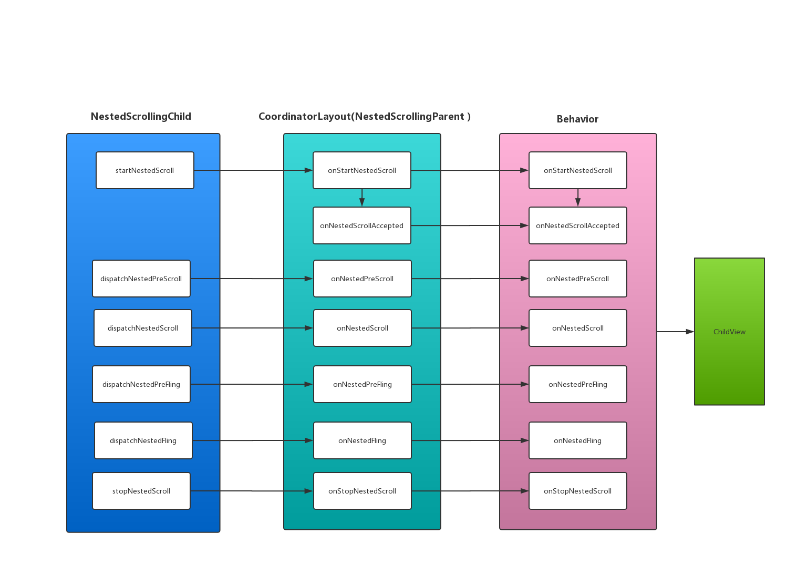

### 前言

在上篇文章中，我们介绍了CoordainatorLayout下的Behavior机制，为了帮助大家更好的理解并运用Behavior，现在我们通过一个Demo，来巩固我们之前学习的知识点。

> 该博客中涉及到的示例，在[NestedScrollingDemo](https://github.com/AndyJennifer/NestedScrollingDemo)项目中都有实现，大家可以按需自取。

### 效果展示

先看一下我们需要实现的效果吧，如下图所示：



>**友情提示**：Demo中涉及到的控件为CoordinatorLayout、TextView、RecyclerView。文章都会围绕这三个控件进行讲解。

从Demo效果来看，这是非常简单的嵌套滑动。如果采用我们之前所学的`NestedScrollingParent2`与`NestedScrollingChild2`实现接口的方式。我们能非常迅速的解决问题。但是如果采用自定义Behavior的话，那么就稍微有点难度了。不过不用担心，只要一步一步慢慢分析，就总能解决问题的。

### RecyclerView布局与测量的分析

在Demo中，RecyclerView与TextView开始的布局关系如下图所示：



根据在文章中我们所学的知识点，我们知道CoordinatorLayout对子控件的布局是类似于FrameLayout的，所以为了保证RecyclerView在TextView的下方显示，我们需要创建属于RecyclerView的Behavior，并在该Behavior的`onLayoutChild`方法中处理RecyclerView与TextView的位置关系。

除了解决RecyclerView的位置关系以外，在该Demo中，我们还可以看出，RecyclerView与TextView之间有着一个联动的关系（这里指的是RecyclerView与TextView之间的位置关系，而不是RecyclerView中的内容)。随着TextView逐渐上移的时候，下方的RecyclerView也跟着往上移动。那么我们可以确定的是RecyclerView必然是依赖TextView的。也就是说我们需要重写Behavior的`layoutDependsOn`与`onDependentViewChanged`方法。

>确定一个控件（childView1)依赖另外一个控件(childView2)的时候，是通过`layoutDependsOn(CoordinatorLayout parent, V child, View dependency)`这个方法。其中child是依赖对象(childView1)，而dependency是被依赖对象(childView2)，该方法的返回值是判断是否依赖对应view。如果返回true。那么表示依赖。反之不依赖。一般情况下，在我们自定义Behavior时，我们需要重写该方法。当`layoutDependsOn`方法返回true时，后面的`onDependentViewChanged`与`onDependentViewRemoved`方法才会调用。

除了考虑以上因数以外，我们还需要考虑RecyclerView的高度。观察Demo，我们可以看出，RecylerView在移动前后，始终都是填充整个屏幕的。为了保证RecylerView在移动过程中，屏幕中不会出现空白（如下图所示）。我们也需要在CoordinatorLayout测量该控件的高度之前，让控件自主的去测量高度。也就是重写RecylerView对应Behavior中的`onMeasureChild`方法。



#### RecyclerView的Behavior代码实现

分析了RecyclerView的Behavior需要重写的内容后，我们来看看具体的Behavior实现类`HeaderScrollingViewBehavior`。为了帮助大家理解，我将RecyclerView的Behavior拆成了几个部分，代码如下所示：

>查看该Behavior完整代码，请点击--->[HeaderScrollingViewBehavior](https://github.com/AndyJennifer/NestedScrollingDemo/blob/master/app/src/main/java/com/jennifer/andy/nestedscrollingdemo/ui/cdl/behavior/HeaderScrollingViewBehavior.java)

```java
public class HeaderScrollingViewBehavior extends CoordinatorLayout.Behavior<View> {

    public HeaderScrollingViewBehavior() {}

    public HeaderScrollingViewBehavior(Context context, AttributeSet attrs) {
        super(context, attrs);
    }
    /**
     * 依赖TextView
     */
    @Override
    public boolean layoutDependsOn(CoordinatorLayout parent, View child, View dependency) {
        return dependency instanceof TextView;
    }
    //省略部分代码...
}
```

>注意：在xml引用自定义Behavior时，一定要声明构造函数。不然在程序的编译过程中，会提示知道不到相应的Behavior。

`layoutDependsOn`方法的逻辑非常简单。就是判断依赖的对象是否是TextView。我们继续查看该类中的`onMeasureChild`方法。代码如下所示：

```java
@Override
    public boolean onMeasureChild(CoordinatorLayout parent, View child, int parentWidthMeasureSpec, int widthUsed, int parentHeightMeasureSpec, int heightUsed) {

        //获取当前滚动控件的测量模式
        final int childLpHeight = child.getLayoutParams().height;

        //只有当前滚动控件为match_parent/wrap_content时才重新测量其高度，因为固定高度不会出现底部空白的情况
        if (childLpHeight == ViewGroup.LayoutParams.MATCH_PARENT
                || childLpHeight == ViewGroup.LayoutParams.WRAP_CONTENT) {

            //获取当前child依赖的对象集合
            final List<View> dependencies = parent.getDependencies(child);

            final View header = findFirstDependency(dependencies);
            if (header != null) {
                if (ViewCompat.getFitsSystemWindows(header)
                        && !ViewCompat.getFitsSystemWindows(child)) {
                    // If the header is fitting system windows then we need to also,
                    // otherwise we'll get CoL's compatible measuring
                    ViewCompat.setFitsSystemWindows(child, true);

                    if (ViewCompat.getFitsSystemWindows(child)) {
                        // If the set succeeded, trigger a new layout and return true
                        child.requestLayout();
                        return true;
                    }
                }
                //获取当前父控件中可用的距离，
                int availableHeight = View.MeasureSpec.getSize(parentHeightMeasureSpec);
                if (availableHeight == 0) {

                    // If the measure spec doesn't specify a size, use the current height
                    availableHeight = parent.getHeight();
                }
                //计算当前滚动控件的高度。
                final int height = availableHeight - header.getMeasuredHeight() + getScrollRange(header);
                final int heightMeasureSpec = View.MeasureSpec.makeMeasureSpec(height,
                        childLpHeight == ViewGroup.LayoutParams.MATCH_PARENT
                                ? View.MeasureSpec.EXACTLY
                                : View.MeasureSpec.AT_MOST);

                //测量当前滚动的View的正确高度
                parent.onMeasureChild(child, parentWidthMeasureSpec,
                        widthUsed, heightMeasureSpec, heightUsed);

                return true;
            }
        }
        return false;
    }
```

测量逻辑的基本步骤：

1. 获取当前控件的测量模式，判断是否采用的`match_parent`或者`wrap_content`。（对于精准模式，我们不用考虑，控件是否填充屏幕）
2. 当满足条件1，获取当前RecyclerView所依赖的header(TextView），根据当前TextView的高度，计算出控件A的实际高度(RecyclerView的父控件可用的高度`-`TextView的高度`+`TextView的滚动范围)

在`onMeasureChild`方法中，我省略了部分方法的介绍，如`findFirstDependency`、`getScrollRange`方法。这些方法在[NestedScrollingDemo](https://github.com/AndyJennifer/NestedScrollingDemo)项目中都有实现。大家可以按需自取。

我们继续查看`HeaderScrollingViewBehavior`类中的`onLayoutChild`方法，代码如下所示：

```java
      @Override
    public boolean onLayoutChild(CoordinatorLayout parent, View child, int layoutDirection) {
        final List<View> dependencies = parent.getDependencies(child);
        final View header = findFirstDependency(dependencies);

        if (header != null) {
            final CoordinatorLayout.LayoutParams lp =
                    (CoordinatorLayout.LayoutParams) child.getLayoutParams();
            final Rect available = mTempRect1;

           //得到依赖控件下方的坐标。
            available.set(parent.getPaddingLeft() + lp.leftMargin,
                    header.getBottom() + lp.topMargin,
                    parent.getWidth() - parent.getPaddingRight() - lp.rightMargin,
                    parent.getHeight() + header.getBottom()
                            - parent.getPaddingBottom() - lp.bottomMargin);

            //拿到上面计算的坐标后，根据当前控件在父控件中设置的gravity,重新计算并得到控件在父控件中的坐标
            final Rect out = mTempRect2;
            GravityCompat.apply(resolveGravity(lp.gravity), child.getMeasuredWidth(),
                    child.getMeasuredHeight(), available, out, layoutDirection);

            //拿到坐标后重新布局
            child.layout(out.left, out.top, out.right, out.bottom);

        } else {
            //如果没有依赖，则调用父控件来处理布局
            parent.onLayoutChild(child, layoutDirection);
        }
        return true;
    }
```

`onLayoutChild`方法逻辑也不算复杂，根据当前所依赖的header(TextView)的位置，将RecyclerView设置在TextView下方。我们继续查看RecyclerView与TextView的联动处理。也就是`onDependentViewChanged`方法。代码如下所示：

```java
    @Override
    public boolean onDependentViewChanged(CoordinatorLayout parent, View child, View dependency) {
        final CoordinatorLayout.Behavior behavior =
                ((CoordinatorLayout.LayoutParams) dependency.getLayoutParams()).getBehavior();
        if (behavior instanceof NestedHeaderBehavior) {
            ViewCompat.offsetTopAndBottom(child, dependency.getBottom() - child.getTop() + ((NestedHeaderBehavior) behavior).getOffset());
        }
        //如果当前的控件的位置发生了改变，该返回值一定要返回为true
        return true;
    }
```

在该方法中，我们需要通过TextView的Behavior(`NestedHeaderBehavior`)，并获得TextView的实际偏移量（上述代码中的`getOffset()`)。通过该偏移量我们可以重新设置RecyclerView的位置。当然，改变控件位置的方式有很多种，我们可以使用`setTransationY`或`View.offsetTopAndBottom`及其他方式，大家可以采用自己喜欢的方式。因为涉及到TextView中Behavior的偏移量。那下面我们就来看看TextView对应Behavior的分析与实现吧。

### TextView嵌套滑动的分析

在整个Demo中，TextView的嵌套滑动效果并不复杂。这里我们就从向上与向下两个方向来介绍。

- 向上滑动：
只有当TextView滑动至屏幕外时，RecyclerView才能处理内部内容的滚动。
- 向下滑动：
当TextView已经被划出屏幕且RecylerView中的内容不能继续向下滑动时，那么就将TextView滑动至显示。否则RecyclerView单独处理内部内容的滚动。

#### TextView的Behavior代码实现

在讲解TextView的Behavior的代码实现之前，我们需要回顾一下在CooordinatoLayout下嵌套方法的传递过程，如下图所示：



通过回顾流程，在结合本文例子中展示的效果，我们需要重写Behavior中的`onStartNestedScroll`与`onNestedPreScroll`和`onNestedScroll`三个方法。来看TextView的`NestedHeaderBehavior`实现。代码如下所示：

>查看该Behavior完整代码，请点击--->[NestedHeaderBehavior](https://github.com/AndyJennifer/NestedScrollingDemo/blob/master/app/src/main/java/com/jennifer/andy/nestedscrollingdemo/ui/cdl/behavior/NestedHeaderBehavior.java)

```java
public class NestedHeaderBehavior extends CoordinatorLayout.Behavior<View> {


    private WeakReference<View> mNestedScrollingChildRef;
    private int mOffset;//记录当前布局的偏移量

    public NestedHeaderBehavior(Context context, AttributeSet attrs) {
        super(context, attrs);
    }

    @Override
    public boolean onLayoutChild(CoordinatorLayout parent, View child, int layoutDirection) {
        mNestedScrollingChildRef = new WeakReference<>(findScrollingChild(parent));
        return super.onLayoutChild(parent, child, layoutDirection);
    }
    //省略部分代码...
}
```

TextView中NestedHeaderBehavior类的声明与RecyclerView中的Behavior基本一样。因为我们需要将偏移量传递给RecyclerView，所以在`NestedHeaderBehavior`的onLayoutChild方法中，我们去创建了关于RecyclerView的弱引用，并设置了`mOffset`变量来记录TextViwe每次滑动的偏移量。如何获取RecyclerView，可以查看项目中源码的实现。接下来，我们继续查看相关嵌套方法实现。

```java
    @Override
    public boolean onStartNestedScroll(@NonNull CoordinatorLayout coordinatorLayout, @NonNull View child, @NonNull View directTargetChild, @NonNull View target, int axes, int type) {
        //只要竖直方向上就拦截
        return (axes & ViewCompat.SCROLL_AXIS_VERTICAL) != 0;
    }
```

在`onStartNestedScroll`方法中，我们设置了当前控件，只能拦截竖直方向上的嵌套滑动事件。继续查看`onNestedPreScroll`方法。代码如下所示：

```java
    @Override
    public void onNestedPreScroll(@NonNull CoordinatorLayout coordinatorLayout, @NonNull View child, @NonNull View target, int dx, int dy, @NonNull int[] consumed, int type) {
        View scrollingChild = mNestedScrollingChildRef.get();
        if (target != scrollingChild) {
            return;
        }
        int currentTop = child.getTop();
        int newTop = currentTop - dy;
        if (dy > 0) {//向上滑动
            //处理在范围内的滚动与fling
            if (newTop >= -child.getHeight()) {
                Log.i(TAG, "onNestedPreScroll:向上移动" + "currentTop--->" + currentTop + " newTop--->" + newTop);
                consumed[1] = dy;
                mOffset = -dy;
                ViewCompat.offsetTopAndBottom(child, -dy);
                coordinatorLayout.dispatchDependentViewsChanged(child);
            } else { //当超过后，单独处理
                consumed[1] = child.getHeight() + currentTop;
                mOffset = -consumed[1];
                ViewCompat.offsetTopAndBottom(child, -consumed[1]);
                coordinatorLayout.dispatchDependentViewsChanged(child);
            }
        }
        if (dy < 0) {//向下滑动
            if (newTop <= 0 && !target.canScrollVertically(-1)) {
                Log.i(TAG, "onNestedPreScroll:向下移动" + "currentTop--->" + currentTop + " newTop--->" + newTop);
                consumed[1] = dy;
                mOffset = -dy;
                ViewCompat.offsetTopAndBottom(child, -dy);
                coordinatorLayout.dispatchDependentViewsChanged(child);
            }
        }

    }

```

`onNestedPreScroll`方法中的逻辑较为复杂。不急我们慢慢分析：

- 首先我们得到当前TextView的Top高度（`currentTop`）。然后根据当前偏移距离`dy`，计算出TextView新的Top高度(`newTop`)。
- 如果`dy>0`,也就是向上滑动。我们判断偏移后的Top(`newTop`)高度是否大于`负`的TextView的测量的高度。

> 因为是向上滑动，当TextView移出屏幕后，通过调用getTop方法获取的高度肯定为负数。这里判断是否大于等于`-child.getHeight`，表示的是当前TextView没有超过它的滚动范围（-child.getHeight到0)。

  1. 如果`newTop >= -child.getHeight()`，则TextView消耗掉`dy`，通过`ViewCompat.offsetTopAndBottom(child, -dy)`来移动当前TextView，接着记录TextView位置的偏移量（`mOffest`），最后通过调用CoordinatorLayout下的`dispatchDependentViewsChanged`方法，通知控件RecyclerView所依赖的TextView发生了改变。那么RecyclerView收到通知后，就可以拿着这个偏移量和TextView一起联动了。
  2. 如果`newTop< - child.getHeight()`，表示在当前偏移距离`dy`下，如果TextView会超过它的滚动范围。那么我们就不能使用当前`dy`来移动TextView。我们只能滚动剩下的范围，也就是child.getHeight() `+`currentTop,(这里使用加号，是因为滚动范围为`-child.getHeight`到`0`）。

- 如果`dy<0`，表示向下滑动，只有在target(RecyclerView)不能向下滑动且TextView已经部分移出屏幕时，我们的TextView才能向下滑动。这里的处理方式基本和上滑一样，这里就不再进行介绍了。我们继续查看最后的方法`onNestedScroll`方法。

```java
    @Override
    public void onNestedScroll(@NonNull CoordinatorLayout coordinatorLayout, @NonNull View child, @NonNull View target, int dxConsumed, int dyConsumed, int dxUnconsumed, int dyUnconsumed, int type) {
        if (dyUnconsumed < 0) {//表示已经向下滑动到头。
            int currentTop = child.getTop();
            int newTop = currentTop - dyUnconsumed;
            if (newTop <= 0) {//如果当前的值在滚动范围之内。
                Log.i(TAG, "onNestedScroll: " + "dyUnconsumed--> " + dyUnconsumed + " currentTop--->" + currentTop + " newTop--->" + newTop);
                ViewCompat.offsetTopAndBottom(child, -dyUnconsumed);
                mOffset = -dyUnconsumed;
            } else {//如果当前的值大于最大的滚动范围（0)，那么就直接滚动到-currentTop就行了
                ViewCompat.offsetTopAndBottom(child, -currentTop);
                mOffset = -currentTop;
            }
            coordinatorLayout.dispatchDependentViewsChanged(child);
        }
    }
```

`onNestedScroll`方法中，我们需要处理RecyclerView向下方向上未消耗的距离(`dyUnconsumed`)。同样根据当前偏移记录计算出TextVie新的Top高度，计算出是否超出其滚功范围范围。如果没有超过，则TextView向下偏移距离为`-dyUnconsumed`,同时记录偏移量(`mOffset=-dyUnconsumed`),最后通知RecyclerView，TextView的位置发生了改变。反之，当前TextView的top的值是多少，那么TextView就向下偏移多少。

### 最后

在该文章中，我着重讲解了相应Behavior中比较重要的一些方法。一些不是那么重要的辅助方法，我并没有做过多的介绍。建议大家配合[NestedScrollingDemo](https://github.com/AndyJennifer/NestedScrollingDemo)项目中的源码理解该篇文章，我相信肯定是事半功倍的。

### 最最后

关于嵌套滑动、CoordinatorLayout、Behavior的知识点基本介绍完毕了。我相信大家以后再遇见一些嵌套滑动的问题。都能够轻松的解决了。可能很多小伙伴会好奇，为什么没有接着讲AppBarLayout与CollapsingTollbarLayout的原理及使用。其实原因非常简单，因为上述的两个控件的实现原理，其实是依托于CoordinatorLayout与自定义Behavior罢了。授人以鱼,不如授人以渔。AppBarLayout与CollapsingTollbarLayout的使用及原理。就算给大家留的课后思考题吧。谢谢大家对这系列的关注。Thanks。
